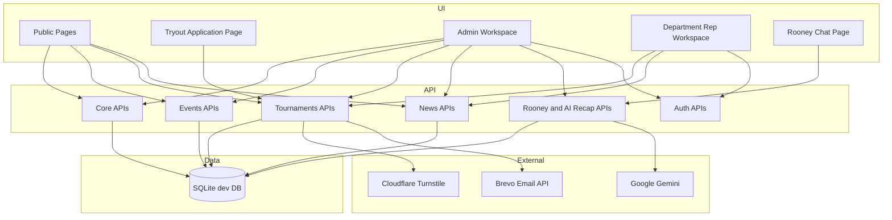

# 01 - System Overview

## Purpose

Enverga Arena is an intramurals platform for Manuel S. Enverga University Foundation. It supports:

- public viewing of schedules, results, medal tally, leaderboard, news, and Rooney AI
- public verified student tryout applications without student accounts
- department-representative tryout review, participant conversion, roster building, and registration submission
- admin management of departments, venues, categories, events, schedules, registrations, participants, results, medal tally, leaderboard, news, AI recaps, and Rooney logs
- grounded Rooney AI FAQ responses based on official system data
- admin-reviewed AI recap drafts published as official news

## Business Scope

### In Scope

- event category and configurable event management
- venue and venue-area management
- schedule slot creation/editing with venue-area conflict validation
- public tryout application flow with Turnstile and student-email OTP
- department-scoped tryout review and participant conversion
- department registration and admin approval/revision workflow
- match-based and rank-based result recording
- medal ledger and Olympic-style medal tally
- NewsArticle publishing and public news browsing
- AIRecap generation, review, approval, discard, and publish-to-news workflow
- Rooney AI query endpoint and query audit logging

### Out of Scope in Current Implementation

- student account login
- payment and billing workflows
- multi-tenant school support
- production-grade deployment profile and infrastructure-as-code
- full observability stack with metrics, tracing, and centralized logs
- asynchronous AI/task queue processing

## Primary User Roles

- Public Viewer
- Student Applicant through public tryout form only
- Department Representative
- Admin / Sports Coordinator

Authenticated role values are represented in JWT claims as `admin`, `department_rep`, or `none`.

## High-Level Architectural Style

The current system uses a modular monolith pattern:

- one Django service hosts all API domains
- one relational database contains operational data
- one React SPA consumes API endpoints
- external services are invoked from the backend for AI, bot protection, and email

## Bounded Contexts / Modules

| Context | Backend App | Responsibilities |
| --- | --- | --- |
| Identity and Core Reference | `core` | departments, venues, venue areas, user profiles, auth cookie helpers, news articles |
| Event Catalog | `events` | event categories, event definitions, result modes, metadata, status, archive state |
| Competition Operations | `tournaments` | schedules, athletes, OTPs, tryout applications, registrations, rosters, results, medals, tally |
| AI FAQ and Recaps | `rooney` | Rooney grounding/LLM calls/logging, AI recap generation, recap publishing |

## Quality Attribute Priorities

1. Correctness of official results and standings.
2. Role-based data segregation for department workflows.
3. Auditability of Rooney responses, AI recaps, and official news publication.
4. Operational usability for admin and department representative workflows.
5. Fast demo iteration over intramurals event configuration.

## System Constraints

- development database is SQLite at `backend/db.sqlite3`
- PostgreSQL driver is installed but settings currently default to SQLite
- DRF default permission class is `AllowAny`, tightened per-view where needed
- protected frontend sessions depend on an in-memory access token and HttpOnly refresh cookie
- Rooney and AI recaps require `GEMINI_API_KEY` for model output, with grounded template fallback for recap generation
- public tryout OTP issuance requires Turnstile and Brevo configuration for real email delivery

## Key Architectural Decisions

1. Result family split (`match_based` vs `rank_based`) is first-class in the event model.
2. Medal standing is derived from `MedalRecord`, not points or weighted scores.
3. Access JWT includes role and department claims, while refresh JWT is stored in an HttpOnly cookie.
4. Public student tryouts are verified by email OTP instead of student accounts.
5. Rooney context is generated server-side from authoritative DB records.
6. AI recaps are internal drafts until an admin publishes them as `NewsArticle` records.
7. Tournament write workflows centralize business validation in serializers, viewsets, and services.

## Context Diagram

## Assumptions

- University personnel curate official events, schedules, results, and news.
- One representative account is assigned to one department in v1.
- Rooney is informational and does not execute state-changing operations.
- Public users only see public-safe data and published official news.
- Production hardening will preserve current API contracts where feasible.
