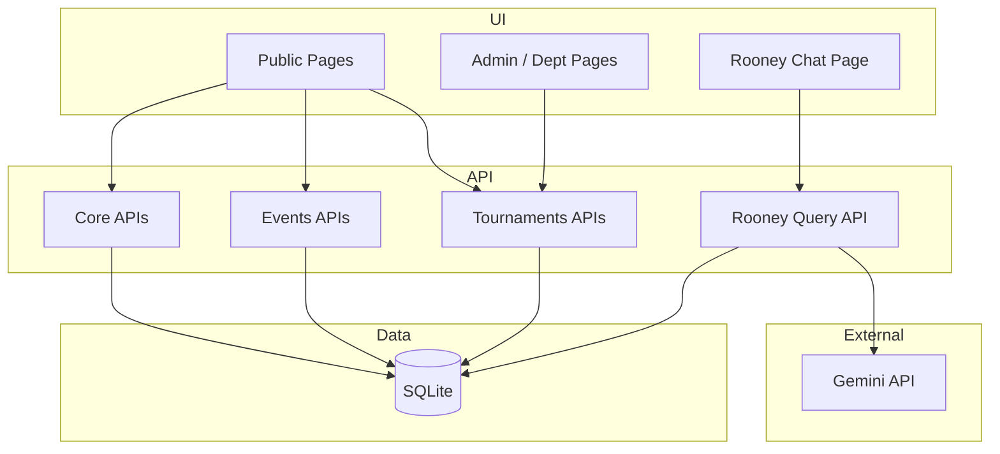

# 01 - System Overview

## Purpose

Enverga Arena is an intramurals platform for Manuel S. Enverga University Foundation that supports:

- public viewing of schedules, results, and medal standings
- department-driven athlete and registration workflows
- admin approval and official result publication
- grounded Rooney AI FAQ responses based on live tournament data

## Business Scope

### In Scope

- event and venue catalog exposure
- schedule publication
- athlete masterlist per department
- event registration and approval workflow
- match-based and rank-based result recording
- medal ledger and computed medal tally
- Rooney AI query endpoint and query audit logging

### Out of Scope in Current Implementation

- multi-tenant school support
- student athlete self-service login
- payment and billing workflows
- production-grade deployment profile and infrastructure-as-code
- full observability stack (metrics tracing centralized logs)

## Primary User Roles

- Public User
- Department Representative
- Admin / Sports Coordinator

Role values are represented in JWT claims as `admin`, `department_rep`, or `none`.

## High-Level Architectural Style

The current system uses a modular monolith pattern:

- one Django service hosts all API domains
- one relational database contains all operational data
- one React SPA consumes API endpoints
- one external AI dependency (Gemini) is invoked by backend Rooney service

## Bounded Contexts / Modules

| Context | Backend App | Responsibilities |
| --- | --- | --- |
| Identity and Core Reference | `core` | departments, venues, venue areas, user profile role mapping, custom JWT claims |
| Event Catalog | `events` | event categories and events with result-family modeling |
| Competition Operations | `tournaments` | schedules, athletes, registrations, roster entries, results, medals, tally |
| AI FAQ | `rooney` | grounded context generation, LLM call orchestration, query logging |

## Quality Attribute Priorities

1. Correctness of official results and standings.
2. Auditability of Rooney responses and medal computations.
3. Operational simplicity for school deployment.
4. Role-based data segregation for department workflows.
5. Fast iteration over intramurals event configuration.

## System Constraints

- backend currently configured to SQLite
- `CORS_ALLOW_ALL_ORIGINS = True` for development convenience
- DRF default permission class is `AllowAny`, tightened per-view where needed
- Rooney requires `GEMINI_API_KEY` in environment

## Key Architectural Decisions

1. Result family split (`match_based` vs `rank_based`) is first-class in the data model.
2. Medal standing is derived from `MedalRecord`, not from raw result rows at query-time.
3. JWT includes role and department claims to reduce frontend lookup round trips.
4. Rooney context is generated server-side from authoritative DB records.
5. Tournament module centralizes write workflows and business validations in serializers/viewsets/services.

## Context Diagram

## Assumptions

- University personnel curate event definitions and approval decisions.
- Rooney is informational and does not execute state-changing operations.
- Any production hardening will preserve current API contracts where feasible.
