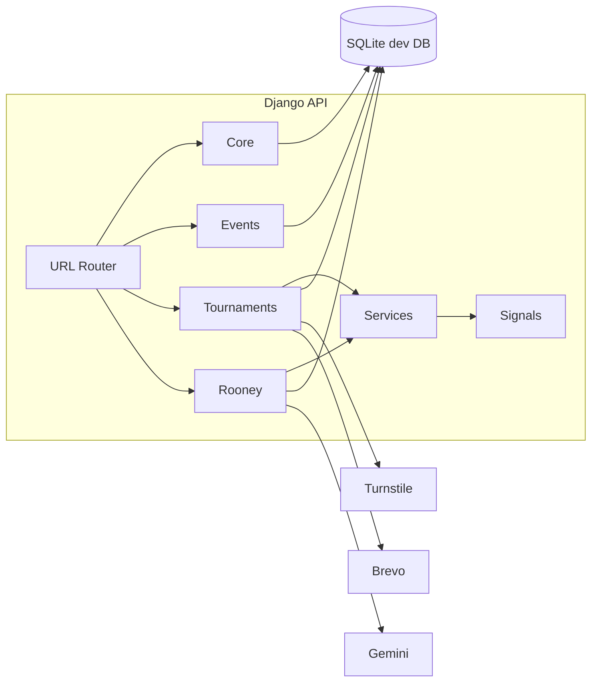

# 02 - Backend Architecture

## Backend Stack

- Python / Django 6.0.4
- Django REST Framework 3.17.1
- djangorestframework-simplejwt 5.5.1
- django-cors-headers 4.9.0
- google-genai 1.53.0
- python-dotenv 1.2.2
- PyJWT 2.12.1
- psycopg2-binary 2.9.12 installed for PostgreSQL readiness
- SQLite for the current committed development database configuration

## Project Structure

- `backend/manage.py`: Django CLI entry point.
- `backend/backend/settings.py`: environment loading, installed apps, middleware, REST/JWT/CORS settings, external service settings.
- `backend/backend/urls.py`: route registration through DRF routers plus auth, public tryout, Rooney, and admin AI/news endpoints.

Domain apps:

- `backend/core`: departments, venues, venue areas, user profiles, auth cookie helpers, news.
- `backend/events`: event categories and configurable event definitions.
- `backend/tournaments`: schedules, athletes, public tryout verification, registrations, rosters, results, medal ledger, tally.
- `backend/rooney`: Rooney query logs, grounding, Gemini calls, AI recap draft generation/review/publishing.

## Configuration and Bootstrapping

### Environment Loading

`settings.py` loads environment variables from:

1. `backend/.env`
2. repo-root `.env` as a local fallback

The committed template is `backend/.env.example`.

### Installed Apps

- Django defaults
- `corsheaders`
- `rest_framework`
- `rest_framework_simplejwt`
- `core`
- `events`
- `rooney`
- `tournaments`

### Middleware

`corsheaders.middleware.CorsMiddleware` is included early enough to attach CORS headers for frontend dev-server requests.

### REST Defaults

- Authentication: `JWTAuthentication`.
- Default permission: `AllowAny`, with app/viewset-specific permissions for writes and protected data.

### Database

`DATABASES['default']` currently uses SQLite at `backend/db.sqlite3`.

`DATABASE_URL` is documented for future PostgreSQL deployment, but the current settings file does not parse it yet.

## Auth and Session Architecture

### Login

`CookieTokenObtainPairView` uses `CustomTokenObtainPairSerializer`.

- returns only the access token in the response body
- removes the refresh token from JSON
- writes the refresh token into an HttpOnly cookie configured by env variables

### Refresh

`CookieTokenRefreshView` reads the refresh token from the configured cookie and returns a fresh access token.

If refresh rotation is enabled by env, the rotated refresh token is set back into the cookie.

### Logout

`LogoutView` clears the configured refresh cookie. The frontend clears the in-memory access token.

### Current User

`CurrentUserView` returns the same auth payload shape used in JWT claims, although the frontend primarily decodes claims from the access token.

## URL Topology

Defined in `backend/backend/urls.py`.

Detailed route-to-code mappings are maintained in `architecture/05-api-contracts.md`.

### Auth

- `POST /api/auth/login/`: `core.views.CookieTokenObtainPairView`
- `POST /api/auth/refresh/`: `core.views.CookieTokenRefreshView`
- `POST /api/auth/logout/`: `core.views.LogoutView`
- `GET /api/auth/me/`: `core.views.CurrentUserView`

### Public Tryout Verification

- `POST /api/public/tryouts/send-otp/`: `tournaments.views.TryoutSendOtpView`
- `POST /api/public/tryouts/verify-otp/`: `tournaments.views.TryoutVerifyOtpView`
- `POST /api/public/tryouts/apply/`: `tournaments.views.TryoutApplyView`

### Admin-Only Router Under `/api/admin/`

- `news`: `core.views.AdminNewsArticleViewSet`
- `ai-recaps`: `rooney.views.AIRecapViewSet`

### DRF Router Under `/api/public/`

- Core: `DepartmentViewSet`, `VenueViewSet`, `VenueAreaViewSet`, `PublicNewsArticleViewSet`
- Events: `EventViewSet`, `EventCategoryViewSet`
- Tournaments: `AthleteViewSet`, `TryoutApplicationViewSet`, `EventRegistrationViewSet`, `EventScheduleViewSet`, `MatchResultViewSet`, `PodiumResultViewSet`, `MedalRecordViewSet`, `MedalTallyViewSet`
- Rooney admin monitoring: `RooneyQueryLogViewSet`

Despite the `/public/` prefix, write permissions are enforced per viewset. Some endpoints under this router are public-read/admin-write or authenticated/scoped.

## Core App (`backend/core`)

### Models

- `Department`
- `Venue`
- `VenueArea`
- `UserProfile`
- `NewsArticle`

### API

- departments, venues, and venue areas are public-readable and admin-writable
- public news endpoint returns only `status='published'`
- admin news endpoint supports draft/review/published/archive management

### Auth Helpers

`core.views` owns refresh-cookie set/delete helpers and cookie-backed SimpleJWT views.

### JWT Claims

`CustomTokenObtainPairSerializer` embeds:

- username
- role
- department id/name/acronym

## Events App (`backend/events`)

### Models

- `EventCategory`
- `Event`

`Event` now includes:

- `slug`
- `division`
- `result_family`
- `competition_format`
- `best_of`
- `team_size_min`
- `team_size_max`
- `roster_size_max`
- `medal_bearing`
- `ruleset_ref`
- `sort_order`
- `is_program_event`
- `status`, including `archived`

### API

Events and categories are public-readable and admin-writable through `IsAdminOrReadOnly`.

Serializer safeguards:

- auto-generates unique slugs when omitted
- validates team size and roster size relationships
- blocks result-family changes after schedules exist
- blocks medal-bearing changes after result data exists
- exposes linked schedule, registration, and result counts for admin UX

## Tournaments App (`backend/tournaments`)

### Domain Entities

- `EventSchedule`
- `Athlete`
- `EmailVerificationCode`
- `TryoutApplication`
- `EventRegistration`
- `RosterEntry`
- `MatchResult`
- `MatchSetScore`
- `PodiumResult`
- `MedalRecord`
- `MedalTally`

### Schedule Operations

`EventSchedule` includes:

- event, venue, venue area
- phase and round label
- scheduled start/end
- schedule-level status
- official notes

Validation enforces end-after-start and venue-area overlap protection for active slots.

### Public Tryout Verification

Students do not receive accounts. The public flow:

1. validates `@student.mseuf.edu.ph`
2. verifies Turnstile server-side
3. stores hashed OTP metadata
4. sends OTP via Brevo
5. verifies OTP within expiry/attempt limits
6. creates a verified `TryoutApplication`

### Department Representative Workflow

Department reps are scoped by `UserProfile.department` and can access only their own:

- tryout applications
- participants
- registrations
- rosters

Selected tryout applications can be converted into `Athlete` records.

### Finalization to Medal Pipeline

- final match results call `apply_final_match_result`
- final podium results call `apply_final_podium_result`
- services write `MedalRecord` rows
- signals recompute `MedalTally`
- final result writes also trigger AI recap draft generation

### Medal Semantics

Official ranking is medal-priority only:

1. gold descending
2. silver descending
3. bronze descending
4. department name as stable final sort

No points system is computed or displayed for ranking.

## Rooney App (`backend/rooney`)

### Rooney Query Lifecycle

1. validate incoming question
2. build grounding from public-safe official data
3. call Gemini through configured model chain
4. return grounded answer or refusal
5. persist `RooneyQueryLog`

### Grounding Sources

- medal tally and leaderboard
- schedules
- finalized match and podium results
- published `NewsArticle` records only

### AI Recap Lifecycle

AI recaps are internal/admin-only drafts.

- result finalization can generate `AIRecap`
- admin can manually generate recap from latest final result context
- admin can edit, approve, discard, or publish
- publishing creates or updates a public `NewsArticle` and marks the recap as published

### Model Fallbacks

`GEMINI_PRIMARY_MODEL` defaults to `gemini-2.5-flash-lite`. `GEMINI_BACKUP_MODELS` can list fallback models. Recap generation falls back to template-grounded copy if Gemini is unavailable.

## Cross-Cutting Backend Concerns

### Security and Access Control

- JWT access token is the bearer credential for protected requests.
- refresh token is kept in an HttpOnly cookie.
- write operations depend on view permissions and role checks.
- department scoping is enforced in queryset logic and serializers.

### Auditability

- Rooney query logs persist question, answer/refusal, grounding, and source labels.
- AI recap records persist input snapshots and citation maps.
- `NewsArticle.ai_generated` marks AI-assisted official content.
- Medal records act as the source ledger for standings.

### Operational Utilities

`seed_data` recreates demo departments, accounts, venues, areas, categories, events, schedules, athletes, tryouts, registrations, results, medal records, news, and AI recap drafts.

## Component Diagram

## Backend Architectural Risks

1. `AllowAny` as global default can hide accidental exposure of future endpoints.
2. SQLite limits concurrency and operational resilience in production.
3. AI calls are synchronous and can increase request latency.
4. Medal assignment rules are still generic and may need event-stage awareness.
