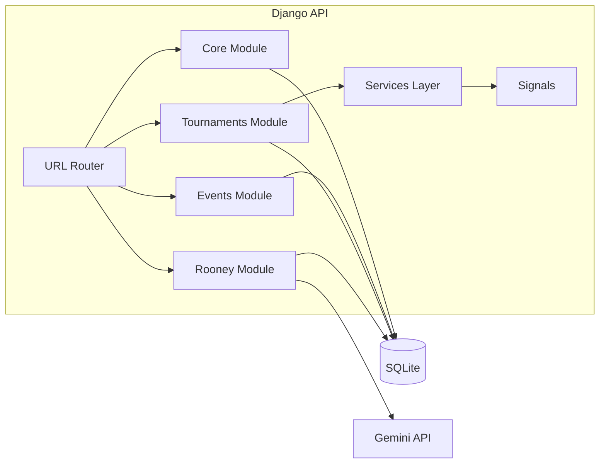

# 02 - Backend Architecture

## Backend Stack

- Python / Django 6.0.4
- Django REST Framework 3.17.1
- djangorestframework-simplejwt 5.5.1
- django-cors-headers 4.9.0
- google-genai 1.53.0
- SQLite (current config)

## Project Structure

- `backend/manage.py`: CLI entry point.
- `backend/backend/settings.py`: global config, middleware, installed apps, DB, REST setup.
- `backend/backend/urls.py`: API route registration via DRF `DefaultRouter` plus auth and Rooney endpoints.

Domain apps:

- `backend/core`: reference data + user profile and JWT customization.
- `backend/events`: event catalog and result family taxonomy.
- `backend/tournaments`: operations and official competition data.
- `backend/rooney`: AI query interface and logs.

## Configuration and Bootstrapping

### Environment Loading

`settings.py` loads `.env` from `BASE_DIR` using `python-dotenv`.

### Installed Apps

- Django default apps
- `corsheaders`
- `rest_framework`
- `rest_framework_simplejwt`
- `core`, `events`, `rooney`, `tournaments`

### Middleware

`corsheaders.middleware.CorsMiddleware` appears early after session middleware to ensure CORS headers are attached.

### REST Defaults

- Authentication: JWT auth class is globally enabled.
- Permission default: `AllowAny` globally, then narrowed at viewset level.

### Database

`DATABASES['default']` is hardcoded to SQLite (`db.sqlite3`) in current repository state.

## URL Topology

Defined in `backend/backend/urls.py`.

### Auth

- `POST /api/auth/login/`
- `POST /api/auth/refresh/`

### Rooney

- `POST /api/public/rooney/query/`

### DRF Router Under `/api/public/`

- Core: departments, venues, venue-areas
- Events: events, event-categories
- Tournaments: athletes, registrations, schedules, match-results, podium-results, medal-records, medal-tally

## App-Level Architecture

## Core App (`backend/core`)

### Models

- `Department`
- `Venue`
- `VenueArea`
- `UserProfile` (one-to-one with Django user, role + optional department)

### API

Read-only viewsets for departments, venues, and venue areas.

### JWT Custom Claims

`CustomTokenObtainPairSerializer` embeds:

- username
- role
- department id/name/acronym

This enables frontend role gating and department scoping without extra user profile fetch.

## Events App (`backend/events`)

### Models

- `EventCategory` (`is_medal_bearing`)
- `Event` (`result_family`, `status`, `is_program_event`)

### API

Read-only viewsets for event categories and events.

Filtering excludes seeded historical category (`Previous Events (Seeded)`) from public output.

## Tournaments App (`backend/tournaments`)

This is the core transactional module.

### Domain Entities

- Scheduling: `EventSchedule`
- Athlete records: `Athlete`
- Registration workflow: `EventRegistration`, `RosterEntry`
- Match-based outcomes: `MatchResult`, `MatchSetScore`
- Rank-based outcomes: `PodiumResult`
- Medal ledger: `MedalRecord`
- Derived standing: `MedalTally`

### Access Patterns

- Public read access to schedules, results, medal endpoints.
- Authenticated access required for athlete and registration operations.
- Admin-only writes for schedules and official results through `IsAdminOrReadOnly`.
- Department reps are row-filtered to their own department for athletes and registrations.

### Validation Strategy

Serializer-level checks include:

- one registration per department per schedule
- roster athletes must belong to submitting department
- schedule start/end consistency
- venue-area conflict detection for active schedules

### Finalization to Medal Pipeline

- `MatchResultViewSet` and `PodiumResultViewSet` call service functions when `is_final=True`.
- Service functions persist/update `MedalRecord` rows.
- Post-save/post-delete signals recompute `MedalTally` for affected department.

### Medal Semantics

Current service default behavior:

- final match result assigns winner = gold and loser = silver
- final podium result writes medal if medal is not `none`

This logic is codified in `tournaments/services.py` and can be adjusted for event-specific medal policies later.

## Rooney App (`backend/rooney`)

### Request Lifecycle

1. Validate incoming question length and shape.
2. Build grounding text from live tournament data.
3. Send grounding + question to Gemini with JSON response schema.
4. Merge source labels from context and model output.
5. Persist `RooneyQueryLog`.
6. Return structured answer object.

### Grounding Sources

- current medal tally top ranks
- today's schedules
- upcoming schedules (next 3 days)
- recent final match results
- recent final podium results

### Failure Behavior

- missing API key returns explicit refusal response
- API exceptions are converted to refusal payloads
- endpoint still returns structured output shape

## Cross-Cutting Backend Concerns

## Security and Access Control

- JWT is primary auth mechanism.
- Write operations depend on view permissions and role checks.
- No object-level permission framework beyond app logic currently.

## Auditability

- Rooney queries are persisted with grounding metadata and refusal reason.
- Medal records act as a ledger baseline for standings.

## Data Consistency

- uniqueness constraints enforce key domain invariants.
- signal-driven tally update ensures standings reflect ledger mutations.
- transaction wrappers are used around create/update methods for key write paths.

## Operational Utilities

`seed_data` management command recreates demo users, departments, venues, events, schedules, registrations, results, medal records, and tallies.

## Component Diagram

## Backend Architectural Risks

1. `AllowAny` as global default can hide accidental exposure of future endpoints.
2. `CORS_ALLOW_ALL_ORIGINS=True` is unsafe for production.
3. SQLite limits concurrency and operational resilience in production.
4. Medal assignment rules are generic and may need event-stage awareness.
