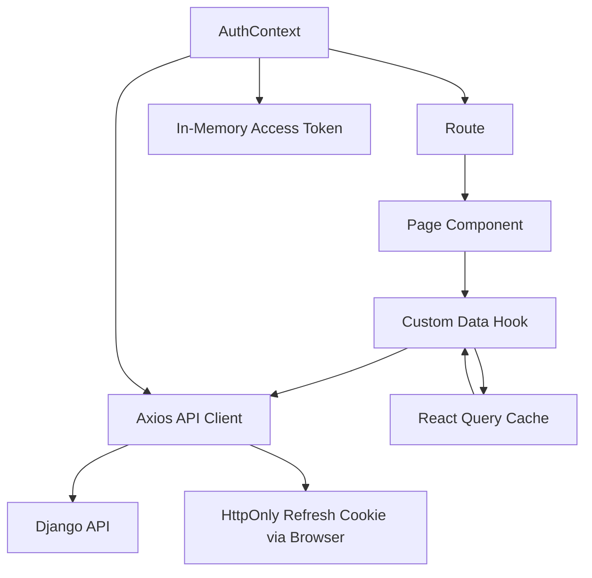

# 03 - Frontend Architecture

## Frontend Stack

- React 19 + TypeScript 6
- Vite 8 build tooling
- React Router DOM 7
- TanStack React Query 5
- Axios
- Tailwind CSS v4 + DaisyUI 5
- date-fns
- lucide-react
- jwt-decode

## Entry and Composition

- `frontend/src/main.tsx` mounts the app.
- `frontend/src/App.tsx` wires:
  - `QueryClientProvider`
  - `AuthProvider`
  - `BrowserRouter`
  - public and protected route trees

## Layout Architecture

`MainLayout` provides the public shell:

- public navigation
- centered page container
- footer

`OperationsLayout` provides the protected admin/representative shell:

- left sidebar navigation
- top bar
- role-aware menu items
- department logo display where appropriate

Global design tokens are defined in `frontend/src/index.css` using Tailwind v4 `@theme` variables and DaisyUI color primitives.

## Routing Model

### Public Routes

- `/`
- `/news`
- `/news/:slug`
- `/schedules`
- `/results`
- `/rooney`
- `/tryouts`
- `/login`

### Admin Routes

Protected by `ProtectedRoute allowedRoles={['admin']}`:

- `/admin`
- `/admin/departments`
- `/admin/venues`
- `/admin/categories`
- `/admin/events`
- `/admin/schedules`
- `/admin/registrations`
- `/admin/participants`
- `/admin/results-entry`
- `/admin/medal-tally`
- `/admin/leaderboard`
- `/admin/news`
- `/admin/ai-recaps`
- `/admin/rooney-logs`
- `/admin/settings`

### Department Representative Routes

Protected by `ProtectedRoute allowedRoles={['department_rep']}`:

- `/portal`
- `/portal/summary`
- `/portal/tryouts`
- `/portal/selected-applicants`
- `/portal/masterlist`
- `/portal/events`
- `/portal/registrations`
- `/portal/rosters`
- `/portal/registration-status`
- `/portal/schedules`
- `/portal/results`
- `/portal/medals`
- `/portal/news`
- `/portal/rooney`

## Authentication Architecture

### Token Storage

`frontend/src/services/auth.ts` stores the access token in runtime memory only.

It does not persist active tokens in:

- `localStorage`
- `sessionStorage`
- IndexedDB
- frontend-readable cookies

It clears legacy local/session storage keys left by older auth implementations.

### Refresh Session Persistence

The refresh token is owned by the backend as an HttpOnly cookie. The frontend cannot read it.

`AuthProvider` restores auth on app startup by calling `refreshAccessToken()`, which posts to `/auth/refresh/` with `withCredentials: true`.

### Session Context

`AuthContext`:

- exposes `user`, `isAuthenticated`, `loginState`, `logoutState`, and `isLoading`
- decodes access token claims with `jwt-decode`
- waits for refresh/session restore before protected routes make redirect decisions

### API Client and Interceptors

`frontend/src/services/api.ts`:

- uses `VITE_API_URL` with fallback `http://localhost:8000/api`
- sets `withCredentials: true`
- attaches the in-memory access token as `Authorization: Bearer <token>`
- on a 401, attempts one cookie-backed refresh
- retries the original request once after refresh
- clears auth state when refresh fails

## Data Fetching and Caching

### Public Data Hooks

`usePublicData.ts` covers:

- schedules
- match results
- podium results
- medal tally
- published news list/detail

### Admin/Protected Data Hooks

`useAdminData.ts` covers:

- departments
- venues
- event categories
- events
- schedules
- athletes
- tryout applications
- registrations
- Rooney logs
- admin news
- AI recaps

Mutations invalidate related React Query keys to refresh pages after create/update/review/finalize/publish operations.

## Page Responsibility Map

| Route | Component | Responsibility |
| --- | --- | --- |
| `/` | `Home` | hero, public CTAs, top-3 leaderboard, latest news |
| `/news` | `News` | published public news list and filters |
| `/news/:slug` | `NewsArticlePage` | full published article page |
| `/schedules` | `Schedules` | public schedule cards |
| `/results` | `Results` | public medal tally, leaderboard, match/podium results |
| `/rooney` | `Rooney` | public grounded Rooney assistant |
| `/tryouts` | `TryoutApply` | public verified student tryout application flow |
| `/login` | `Login` | admin/rep login |
| `/admin` | `Dashboard` | admin KPIs, approvals, snapshots, quick actions |
| `/admin/events` | `EventsPage` | event management with create/edit/archive |
| `/admin/schedules` | `SchedulesAdminPage` | schedule slot management with venue conflict awareness |
| `/admin/news` | `NewsPage` | official article management |
| `/admin/ai-recaps` | `AiRecapsPage` | recap review desk and publish-to-news |
| `/portal` | `Dashboard` | representative department command center |
| `/portal/tryouts` | `TryoutApplicationsPage` | department-scoped tryout review |
| `/portal/rosters` | `RosterBuilderPage` | roster assignment from department participants |

## Role-Driven UX Behavior

### Admin

- manages global operational data
- reviews registrations
- updates schedules, events, results, news, AI recaps
- can open public site from dashboard in a new tab

### Department Representative

- sees one department only
- reviews verified tryout applications for that department
- converts selected applicants to participants
- builds rosters and submits registrations
- reads public news and opens Rooney
- can open public site from dashboard in a new tab

### Public

- can browse schedules, results, medal tally, leaderboard, news, and Rooney
- can submit verified tryout applications
- cannot see private admin or department workflow data

## Rooney and AI Recap Frontend Integration

`Rooney.tsx` posts to `/public/rooney/query/` and renders:

- grounded answer text
- refusal reason when ungrounded
- source labels as chips

Admin AI recap pages call `/admin/ai-recaps/` to:

- list drafts
- generate a draft
- edit generated copy
- approve/discard
- publish as official news

## Frontend State Model

- server state: React Query cache
- auth state: React Context + in-memory access token
- local UI state: component state for modals, forms, filters, drawers, and chat input

## Build and Deployment Model

- `npm run dev` for local Vite development
- `npm run lint` for ESLint
- `npm run build` for TypeScript build and Vite production bundle
- `npm run preview` for local static preview

Safe frontend env variables:

- `VITE_API_URL`
- `VITE_TURNSTILE_SITE_KEY`

No frontend env variable should contain JWT secrets, refresh tokens, API keys, or server-side credentials.

## Component Interaction Diagram

## Frontend Architectural Risks

1. No centralized error boundary strategy for app-level fallback UX.
2. Frontend route protection is UX-only; backend permission correctness remains the true security boundary.
3. No frontend test runner/scripts are currently committed.
4. Large bundle warnings appear during Vite production build and should eventually be addressed with code splitting.
