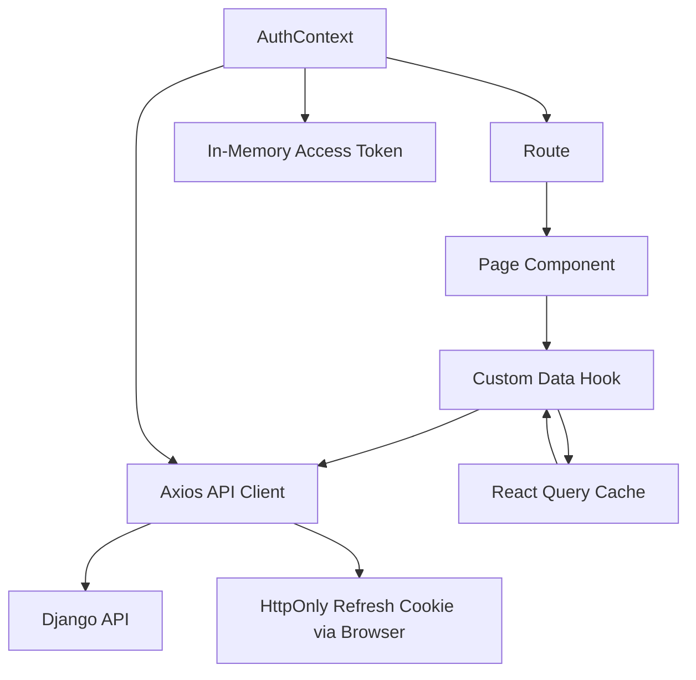

# 03 - Frontend Architecture

## Frontend Stack

- React 19 + TypeScript 6
- Vite 8 build tooling
- React Router DOM 7
- TanStack React Query 5
- Axios
- Tailwind CSS v4 + DaisyUI 5
- date-fns
- lucide-react
- jwt-decode

## Entry and Composition

- `frontend/src/main.tsx` mounts the app.
- `frontend/src/App.tsx` wires:
  - `QueryClientProvider`
  - `AuthProvider`
  - `BrowserRouter`
  - public and protected route trees

## Layout Architecture

`MainLayout` provides the public shell:

- public navigation
- centered page container
- footer

`OperationsLayout` provides the protected admin/representative shell:

- left sidebar navigation
- top bar
- role-aware menu items
- department logo display where appropriate

Global design tokens are defined in `frontend/src/index.css` using Tailwind v4 `@theme` variables and DaisyUI color primitives.

## Routing Model

Frontend routes are defined in `frontend/src/App.tsx`.

The top-level composition is:

```tsx
<QueryClientProvider client={queryClient}>
    <AuthProvider>
        <BrowserRouter>
            <Routes>{/* public and protected route trees */}</Routes>
        </BrowserRouter>
    </AuthProvider>
</QueryClientProvider>
```

Public routes render inside `MainLayout`. Admin and department representative routes render inside `OperationsLayout` after passing `ProtectedRoute`.

The route guard is implemented by `frontend/src/components/ProtectedRoute.tsx::ProtectedRoute`. It:

- waits for `AuthContext.isLoading`
- redirects unauthenticated users to `/login`
- checks `allowedRoles`
- redirects wrong-role users to their role home
- renders nested protected pages with `<Outlet />`

### Public Routes

- `/`
- `/news`
- `/news/:slug`
- `/schedules`
- `/results`
- `/rooney`
- `/tryouts`
- `/login`

### Admin Routes

Protected by `ProtectedRoute allowedRoles={['admin']}`:

- `/admin`
- `/admin/departments`
- `/admin/venues`
- `/admin/categories`
- `/admin/events`
- `/admin/schedules`
- `/admin/registrations`
- `/admin/participants`
- `/admin/results-entry`
- `/admin/medal-tally`
- `/admin/leaderboard`
- `/admin/news`
- `/admin/ai-recaps`
- `/admin/rooney-logs`
- `/admin/settings`

### Department Representative Routes

Protected by `ProtectedRoute allowedRoles={['department_rep']}`:

- `/portal`
- `/portal/summary`
- `/portal/tryouts`
- `/portal/selected-applicants`
- `/portal/masterlist`
- `/portal/events`
- `/portal/registrations`
- `/portal/rosters`
- `/portal/registration-status`
- `/portal/schedules`
- `/portal/results`
- `/portal/medals`
- `/portal/news`
- `/portal/rooney`

## Frontend Route Implementation Map

### Public Route Tree

Code source: `frontend/src/App.tsx`

```tsx
<Route element={<MainLayout />}>
    <Route path="/" element={<Home />} />
    <Route path="/news" element={<News />} />
    <Route path="/news/:slug" element={<NewsArticlePage />} />
    <Route path="/schedules" element={<Schedules />} />
    <Route path="/results" element={<Results />} />
    <Route path="/rooney" element={<Rooney />} />
    <Route path="/tryouts" element={<TryoutApply />} />
    <Route path="/login" element={<Login />} />
</Route>
```

| Route | Component Function/Class | File | Layout / Guard | What It Does | Main API Calls |
| --- | --- | --- | --- | --- | --- |
| `/` | `Home` | `frontend/src/pages/Public/Home.tsx` | `MainLayout` | Public home page with hero CTAs, current leaders, latest news, schedule/results links | `useMedalTally()`, `usePublishedNews()` |
| `/news` | `News` | `frontend/src/pages/Public/News.tsx` | `MainLayout` | Lists published official news with filters/search | `GET /api/public/news/` through `usePublishedNews()` |
| `/news/:slug` | `NewsArticlePage` | `frontend/src/pages/Public/NewsArticle.tsx` | `MainLayout` | Shows one published news article by slug | `GET /api/public/news/{slug}/` through `usePublishedNewsArticle()` |
| `/schedules` | `Schedules` | `frontend/src/pages/Public/Schedules.tsx` | `MainLayout` | Public schedule browsing | `GET /api/public/schedules/` |
| `/results` | `Results` | `frontend/src/pages/Public/Results.tsx` | `MainLayout` | Public results, medal tally, and leaderboard | `GET /api/public/match-results/`, `/podium-results/`, `/medal-tally/` |
| `/rooney` | `Rooney` | `frontend/src/pages/Public/Rooney.tsx` | `MainLayout` | Public grounded Rooney AI interface | `POST /api/public/rooney/query/` |
| `/tryouts` | `TryoutApply` | `frontend/src/pages/Public/TryoutApply.tsx` | `MainLayout` | Public verified tryout application flow | `POST /api/public/tryouts/send-otp/`, `/api/public/tryouts/verify-otp/`, `/api/public/tryouts/apply/`; also public departments/schedules |
| `/login` | `Login` | `frontend/src/pages/Auth/Login.tsx` | `MainLayout` | Admin/department representative login page | `POST /api/auth/login/` through `loginRequest()` |

### Admin Route Tree

Code source: `frontend/src/App.tsx`

```tsx
<Route element={<ProtectedRoute allowedRoles={['admin']} />}>
    <Route element={<OperationsLayout mode="admin" />}>
        <Route path="/admin" element={<Dashboard mode="admin" />} />
        <Route path="/admin/departments" element={<DepartmentsPage />} />
        <Route path="/admin/venues" element={<VenuesPage />} />
        <Route path="/admin/categories" element={<CategoriesPage />} />
        <Route path="/admin/events" element={<EventsPage />} />
        <Route path="/admin/schedules" element={<SchedulesAdminPage />} />
        <Route path="/admin/registrations" element={<RegistrationsAdminPage />} />
        <Route path="/admin/participants" element={<ParticipantsAdminPage />} />
        <Route path="/admin/results-entry" element={<ResultsEntryPage />} />
        <Route path="/admin/medal-tally" element={<MedalTallyAdminPage />} />
        <Route path="/admin/leaderboard" element={<LeaderboardAdminPage />} />
        <Route path="/admin/news" element={<NewsPage />} />
        <Route path="/admin/ai-recaps" element={<AiRecapsPage />} />
        <Route path="/admin/rooney-logs" element={<RooneyLogsPage />} />
        <Route path="/admin/settings" element={<SettingsPage />} />
        <Route path="/admin/masterlist" element={<Navigate to="/admin/participants" replace />} />
    </Route>
</Route>
```

| Route | Component Function/Class | File | Layout / Guard | What It Does | Main API Calls |
| --- | --- | --- | --- | --- | --- |
| `/admin` | `Dashboard` with `mode="admin"` | `frontend/src/pages/Admin/Dashboard.tsx` | `ProtectedRoute(['admin'])`, `OperationsLayout` | Sports coordinator dashboard with KPIs, snapshots, quick actions, Rooney/recap previews | Aggregates hooks in `useAdminData.ts` and `usePublicData.ts` |
| `/admin/departments` | `DepartmentsPage` | `frontend/src/pages/Admin/AdminSections.tsx` | Admin protected | Department table, search/filter, representative metadata | `GET /api/public/departments/` |
| `/admin/venues` | `VenuesPage` | `frontend/src/pages/Admin/AdminSections.tsx` | Admin protected | Venue cards, search, add venue form, venue area display | `GET/POST /api/public/venues/` |
| `/admin/categories` | `CategoriesPage` | `frontend/src/pages/Admin/AdminSections.tsx` | Admin protected | Event category management display | `GET /api/public/event-categories/` |
| `/admin/events` | `EventsPage` | `frontend/src/pages/Admin/AdminSections.tsx` | Admin protected | Event list with create/edit/archive/details and filters | `GET/POST/PATCH /api/public/events/` |
| `/admin/schedules` | `SchedulesAdminPage` | `frontend/src/pages/Admin/AdminSections.tsx` | Admin protected | Schedule slot create/edit/status/venue management | `GET/POST/PATCH /api/public/schedules/`, plus events/venues |
| `/admin/registrations` | `RegistrationsAdminPage` | `frontend/src/pages/Admin/AdminSections.tsx` | Admin protected | Registration review workflow and status changes | `GET/PATCH /api/public/registrations/` |
| `/admin/participants` | `ParticipantsAdminPage` | `frontend/src/pages/Admin/AdminSections.tsx` | Admin protected | Athlete/participant table and management | `GET/POST /api/public/athletes/` |
| `/admin/results-entry` | `ResultsEntryPage` | `frontend/src/pages/Admin/AdminSections.tsx` | Admin protected | Match/rank result entry workflow | result endpoints under `/api/public/match-results/` and `/podium-results/` |
| `/admin/medal-tally` | `MedalTallyAdminPage` | `frontend/src/pages/Admin/AdminSections.tsx` | Admin protected | Medal tally verification table | `GET /api/public/medal-tally/`, `/medal-records/` |
| `/admin/leaderboard` | `LeaderboardAdminPage` | `frontend/src/pages/Admin/AdminSections.tsx` | Admin protected | Medal-priority leaderboard admin view | `GET /api/public/medal-tally/` |
| `/admin/news` | `NewsPage` | `frontend/src/pages/Admin/AdminSections.tsx` | Admin protected | Official news management, draft/review/publish/archive | `GET/POST/PATCH /api/admin/news/` |
| `/admin/ai-recaps` | `AiRecapsPage` | `frontend/src/pages/Admin/AdminSections.tsx` | Admin protected | AI recap review desk and publish-to-news flow | `GET/PATCH /api/admin/ai-recaps/`, `POST /generate/`, `/approve/`, `/discard/`, `/publish/` |
| `/admin/rooney-logs` | `RooneyLogsPage` | `frontend/src/pages/Admin/AdminSections.tsx` | Admin protected | Rooney query monitoring table | `GET /api/public/rooney-logs/` |
| `/admin/settings` | `SettingsPage` | `frontend/src/pages/Admin/AdminSections.tsx` | Admin protected | Admin settings/status surface | currently local/static admin settings UI |
| `/admin/masterlist` | `Navigate` | `frontend/src/App.tsx` | Admin protected | Compatibility redirect to participants page | no direct API call |

### Department Representative Route Tree

Code source: `frontend/src/App.tsx`

```tsx
<Route element={<ProtectedRoute allowedRoles={['department_rep']} />}>
    <Route element={<OperationsLayout mode="department_rep" />}>
        <Route path="/portal" element={<Dashboard mode="department_rep" />} />
        <Route path="/portal/summary" element={<DepartmentSummaryPage />} />
        <Route path="/portal/tryouts" element={<TryoutApplicationsPage />} />
        <Route path="/portal/selected-applicants" element={<SelectedApplicantsPage />} />
        <Route path="/portal/masterlist" element={<Masterlist />} />
        <Route path="/portal/events" element={<AvailableEventsPage />} />
        <Route path="/portal/registrations" element={<Dashboard mode="department_rep" />} />
        <Route path="/portal/rosters" element={<RosterBuilderPage />} />
        <Route path="/portal/registration-status" element={<RegistrationStatusPage />} />
        <Route path="/portal/schedules" element={<DepartmentSchedulePage />} />
        <Route path="/portal/results" element={<DepartmentResultsPage />} />
        <Route path="/portal/medals" element={<DepartmentMedalsPage />} />
        <Route path="/portal/news" element={<RepresentativeNewsPage />} />
        <Route path="/portal/rooney" element={<RepresentativeRooneyPage />} />
    </Route>
</Route>
```

| Route | Component Function/Class | File | Layout / Guard | What It Does | Main API Calls |
| --- | --- | --- | --- | --- | --- |
| `/portal` | `Dashboard` with `mode="department_rep"` | `frontend/src/pages/Admin/Dashboard.tsx` | `ProtectedRoute(['department_rep'])`, `OperationsLayout` | Department representative command center scoped to one department | Aggregates scoped registrations, tryouts, participants, public schedule/results |
| `/portal/summary` | `DepartmentSummaryPage` | `frontend/src/pages/Portal/RepresentativePages.tsx` | Rep protected | Department identity, performance, medal summary | departments, registrations, tryouts, medal tally |
| `/portal/tryouts` | `TryoutApplicationsPage` | `frontend/src/pages/Portal/RepresentativePages.tsx` | Rep protected | Review verified tryout applications for representative department | `GET/PATCH /api/public/tryout-applications/` |
| `/portal/selected-applicants` | `SelectedApplicantsPage` | `frontend/src/pages/Portal/RepresentativePages.tsx` | Rep protected | Convert selected applicants into athlete records | `POST /api/public/tryout-applications/{id}/convert/` |
| `/portal/masterlist` | `Masterlist` | `frontend/src/pages/Admin/Masterlist.tsx` | Rep protected | Department participant masterlist | `GET /api/public/athletes/` scoped by backend |
| `/portal/events` | `AvailableEventsPage` | `frontend/src/pages/Portal/RepresentativePages.tsx` | Rep protected | Available event registration preparation | `GET /api/public/events/`, schedules/registrations |
| `/portal/registrations` | `Dashboard` with `mode="department_rep"` | `frontend/src/pages/Admin/Dashboard.tsx` | Rep protected | Current implementation routes to representative dashboard | dashboard data hooks |
| `/portal/rosters` | `RosterBuilderPage` | `frontend/src/pages/Portal/RepresentativePages.tsx` | Rep protected | Build event roster from department participants | registrations, athletes, roster update mutation |
| `/portal/registration-status` | `RegistrationStatusPage` | `frontend/src/pages/Portal/RepresentativePages.tsx` | Rep protected | Track submitted registrations and review notes | `GET/PATCH /api/public/registrations/` scoped by backend |
| `/portal/schedules` | `DepartmentSchedulePage` | `frontend/src/pages/Portal/RepresentativePages.tsx` | Rep protected | Department-relevant schedule view | `GET /api/public/schedules/` filtered client-side by department registrations |
| `/portal/results` | `DepartmentResultsPage` | `frontend/src/pages/Portal/RepresentativePages.tsx` | Rep protected | Department-relevant completed results | match/podium results and medal records |
| `/portal/medals` | `DepartmentMedalsPage` | `frontend/src/pages/Portal/RepresentativePages.tsx` | Rep protected | Department medal summary and rank | `GET /api/public/medal-tally/`, `/medal-records/` |
| `/portal/news` | `RepresentativeNewsPage` | `frontend/src/pages/Portal/RepresentativePages.tsx` | Rep protected | Read-only official announcements/news | `GET /api/public/news/` |
| `/portal/rooney` | `RepresentativeRooneyPage` | `frontend/src/pages/Portal/RepresentativePages.tsx` | Rep protected | Rooney entry point from protected portal | `POST /api/public/rooney/query/` |

## Authentication Architecture

### Token Storage

`frontend/src/services/auth.ts` stores the access token in runtime memory only.

It does not persist active tokens in:

- `localStorage`
- `sessionStorage`
- IndexedDB
- frontend-readable cookies

It clears legacy local/session storage keys left by older auth implementations.

### Refresh Session Persistence

The refresh token is owned by the backend as an HttpOnly cookie. The frontend cannot read it.

`AuthProvider` restores auth on app startup by calling `refreshAccessToken()`, which posts to `/auth/refresh/` with `withCredentials: true`.

### Session Context

`AuthContext`:

- exposes `user`, `isAuthenticated`, `loginState`, `logoutState`, and `isLoading`
- decodes access token claims with `jwt-decode`
- waits for refresh/session restore before protected routes make redirect decisions

### API Client and Interceptors

`frontend/src/services/api.ts`:

- uses `VITE_API_URL` with fallback `http://localhost:8000/api`
- sets `withCredentials: true`
- attaches the in-memory access token as `Authorization: Bearer <token>`
- on a 401, attempts one cookie-backed refresh
- retries the original request once after refresh
- clears auth state when refresh fails

## Data Fetching and Caching

### Public Data Hooks

`usePublicData.ts` covers:

- schedules
- match results
- podium results
- medal tally
- published news list/detail

### Admin/Protected Data Hooks

`useAdminData.ts` covers:

- departments
- venues
- event categories
- events
- schedules
- athletes
- tryout applications
- registrations
- Rooney logs
- admin news
- AI recaps

Mutations invalidate related React Query keys to refresh pages after create/update/review/finalize/publish operations.

## Page Responsibility Map

| Route | Component | Responsibility |
| --- | --- | --- |
| `/` | `Home` | hero, public CTAs, top-3 leaderboard, latest news |
| `/news` | `News` | published public news list and filters |
| `/news/:slug` | `NewsArticlePage` | full published article page |
| `/schedules` | `Schedules` | public schedule cards |
| `/results` | `Results` | public medal tally, leaderboard, match/podium results |
| `/rooney` | `Rooney` | public grounded Rooney assistant |
| `/tryouts` | `TryoutApply` | public verified student tryout application flow |
| `/login` | `Login` | admin/rep login |
| `/admin` | `Dashboard` | admin KPIs, approvals, snapshots, quick actions |
| `/admin/events` | `EventsPage` | event management with create/edit/archive |
| `/admin/schedules` | `SchedulesAdminPage` | schedule slot management with venue conflict awareness |
| `/admin/news` | `NewsPage` | official article management |
| `/admin/ai-recaps` | `AiRecapsPage` | recap review desk and publish-to-news |
| `/portal` | `Dashboard` | representative department command center |
| `/portal/tryouts` | `TryoutApplicationsPage` | department-scoped tryout review |
| `/portal/rosters` | `RosterBuilderPage` | roster assignment from department participants |

## Role-Driven UX Behavior

### Admin

- manages global operational data
- reviews registrations
- updates schedules, events, results, news, AI recaps
- can open public site from dashboard in a new tab

### Department Representative

- sees one department only
- reviews verified tryout applications for that department
- converts selected applicants to participants
- builds rosters and submits registrations
- reads public news and opens Rooney
- can open public site from dashboard in a new tab

### Public

- can browse schedules, results, medal tally, leaderboard, news, and Rooney
- can submit verified tryout applications
- cannot see private admin or department workflow data

## Rooney and AI Recap Frontend Integration

`Rooney.tsx` posts to `/public/rooney/query/` and renders:

- grounded answer text
- refusal reason when ungrounded
- source labels as chips

Admin AI recap pages call `/admin/ai-recaps/` to:

- list drafts
- generate a draft
- edit generated copy
- approve/discard
- publish as official news

## Frontend State Model

- server state: React Query cache
- auth state: React Context + in-memory access token
- local UI state: component state for modals, forms, filters, drawers, and chat input

## Build and Deployment Model

- `npm run dev` for local Vite development
- `npm run lint` for ESLint
- `npm run build` for TypeScript build and Vite production bundle
- `npm run preview` for local static preview

Safe frontend env variables:

- `VITE_API_URL`
- `VITE_TURNSTILE_SITE_KEY`

No frontend env variable should contain JWT secrets, refresh tokens, API keys, or server-side credentials.

## Component Interaction Diagram



## Frontend Architectural Risks

1. No centralized error boundary strategy for app-level fallback UX.
2. Frontend route protection is UX-only; backend permission correctness remains the true security boundary.
3. No frontend test runner/scripts are currently committed.
4. Large bundle warnings appear during Vite production build and should eventually be addressed with code splitting.
