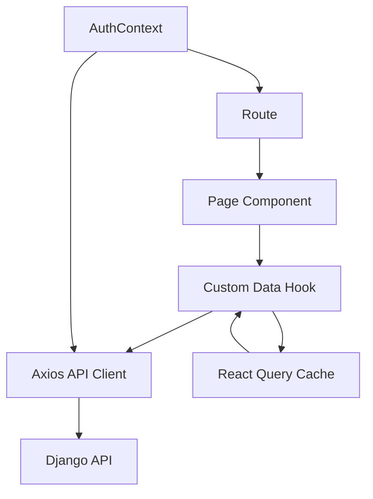

# 03 - Frontend Architecture

## Frontend Stack

- React 19 + TypeScript
- Vite 8 build tooling
- React Router DOM 7
- React Query 5
- Axios
- Tailwind CSS v4 + DaisyUI
- date-fns + lucide-react for formatting and icons

## Entry and Composition

- `frontend/src/main.tsx` mounts app under React `StrictMode`.
- `frontend/src/App.tsx` wires:
  - `QueryClientProvider`
  - `AuthProvider`
  - `BrowserRouter`
  - route tree and protected routes

## Layout Architecture

`MainLayout` provides shared shell:

- sticky top navigation (`Navbar`)
- centered content container
- footer

Global design tokens are defined in `frontend/src/index.css` using Tailwind v4 `@theme` variables and DaisyUI color primitives.

## Routing Model

### Public Routes

- `/`
- `/schedules`
- `/results`
- `/rooney`
- `/login`

### Protected Routes

Wrapped by `ProtectedRoute`:

- `/admin`
- `/admin/masterlist`

Authorized roles:

- `admin`
- `department_rep`

Unauthenticated users are redirected to login with return path state.

## Authentication Architecture

## Token Storage

`frontend/src/services/auth.ts` stores access/refresh JWT tokens in `localStorage`.

## Session Context

`AuthContext`:

- decodes access token on app load
- exposes `user`, `isAuthenticated`, `loginState`, `logoutState`
- user payload includes role and department claims

## API Client and Interceptors

`frontend/src/services/api.ts`:

- sets API base URL from `VITE_API_URL` with fallback `http://localhost:8000/api`
- request interceptor attaches bearer token
- response interceptor attempts refresh token flow on `401`
- failed refresh clears tokens

## Data Fetching and Caching

## React Query Hooks

`usePublicData.ts`:

- schedules
- match results
- podium results
- medal tally

`useAdminData.ts`:

- athlete query and create mutation
- registration query and create mutation
- registration status update mutation

Mutations invalidate related query keys to synchronize UI state.

## Page Responsibility Map

| Route | Component | Responsibility |
| --- | --- | --- |
| `/` | `Home` | landing hero and top-3 leaderboard widget |
| `/schedules` | `Schedules` | schedule cards with participant badges |
| `/results` | `Results` | medal tally and recent results tabs |
| `/rooney` | `Rooney` | chat-style Rooney interaction with source labels |
| `/login` | `Login` | JWT login and redirect |
| `/admin` | `Dashboard` | admin approval queue and department submission flow |
| `/admin/masterlist` | `Masterlist` | department athlete CRUD create/list workflow |

## Role-Driven UX Behavior

### Admin

- sees pending/submitted registrations
- can approve or request revision with notes

### Department Representative

- manages own athlete masterlist
- submits registrations for available schedules
- tracks status and admin feedback

### Public

- can browse schedules, results, and Rooney assistant without login

## Rooney Frontend Integration

`Rooney.tsx` posts to `/public/rooney/query/` and renders:

- grounded answer text
- refusal reason when ungrounded
- source labels as chips

This design surfaces explainability and trust context to end users.

## Frontend State Model

- server state: React Query cache
- auth state: React Context + JWT decode
- local UI state: component state for forms, tabs, and chat input

## Build and Deployment Model

- `npm run dev` for local development with Vite dev server
- `npm run build` creates production static assets
- frontend currently assumes backend URL through environment variable

## Component Interaction Diagram

## Frontend Architectural Risks

1. JWT in localStorage is vulnerable to XSS token theft if XSS is introduced.
2. No centralized error boundary strategy for app-level fallback UX.
3. `App.css` contains template leftovers and does not appear to be actively used.
4. Route protection is frontend-enforced for UX, but true security depends on backend permission correctness.
