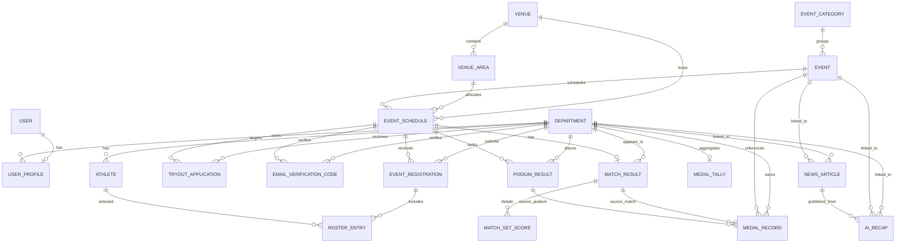

# 04 - Data Model

## Data Architecture Overview

The backend uses a relational schema organized around four Django apps:

1. **Core (`core`)**: departments, venues, user profiles, official news.
2. **Events (`events`)**: event categories and configurable competition definitions.
3. **Tournaments (`tournaments`)**: schedules, OTP verification, tryout applications, athletes, registrations, rosters, results, medals, tally.
4. **Rooney (`rooney`)**: Rooney query audit logs and AI recap drafts.

## Entity Relationship Diagram

## Core Models

### Department

Represents the 10 official participating colleges/departments.

Key fields:

- `name`
- `acronym`
- `color_code`

### Venue

Represents a facility or location used for scheduling.

Key fields:

- `name`
- `campus`
- `building`
- `address`
- `location`
- `is_indoor`
- `is_active`
- `notes`

### VenueArea

Represents a schedulable area inside a venue.

Key fields:

- `venue`
- `name`
- `capacity`

Used by schedule conflict validation.

### UserProfile

One-to-one extension of Django `User`.

Key fields:

- `role`: `admin` or `department_rep`
- `department`: optional FK for department representatives

### NewsArticle

Official public content entity.

Key fields:

- `title`
- `slug`
- `summary`
- `body_md`
- `article_type`: `announcement`, `schedule_update`, `highlight`, `result_recap`, `general_news`
- `source_label`
- optional `event`
- optional `department`
- `status`: `draft`, `review`, `published`, `archived`
- `published_at`
- `ai_generated`
- `created_by`
- `reviewed_by`

Only published articles appear on public pages and Rooney news grounding.

## Event Models

### EventCategory

Groups events such as Ball Games, Aquatics, Cultural, E-Sports, Athletics, Martial Arts, Mind Sports, and Others.

Key fields:

- `name`
- `is_medal_bearing`

### Event

Configurable competition definition.

Key fields:

- `category`
- `name`
- `slug`
- `division`
- `result_family`: `match_based` or `rank_based`
- `competition_format`
- `best_of`
- `team_size_min`
- `team_size_max`
- `roster_size_max`
- `medal_bearing`
- `ruleset_ref`
- `sort_order`
- `is_program_event`
- `status`: `scheduled`, `live`, `completed`, `postponed`, `cancelled`, `archived`

Serializer validation prevents changing `result_family` once schedules exist and prevents changing `medal_bearing` after result data exists.

## Tournament Models

### EventSchedule

Binds an event to a venue, venue area, and time slot.

Key fields:

- `event`
- `venue`
- `venue_area`
- `phase`
- `round_label`
- `scheduled_start`
- `scheduled_end`
- `status`: `scheduled`, `live`, `completed`, `postponed`, `cancelled`
- `notes`

Serializer validation checks date order and active venue-area overlap conflicts.

### Athlete

Department-owned participant record.

Key fields:

- `student_number`
- `full_name`
- `department`
- `program_course`
- `year_level`
- `is_enrolled`
- `medical_cleared`

### EmailVerificationCode

Hashed OTP metadata for public tryout verification.

Key fields:

- `email`
- `student_number`
- `department`
- `schedule`
- `code_hash`
- `expires_at`
- `used_at`
- `attempt_count`
- `request_ip`
- `user_agent`

Plain OTP codes are not stored.

### TryoutApplication

Verified public student tryout application.

Key fields:

- `department`
- `schedule`
- `student_number`
- `full_name`
- `school_email`
- `contact_number`
- `program_course`
- `year_level`
- `prior_experience`
- `notes`
- `email_verified`
- `verified_at`
- `status`: `submitted`, `under_review`, `selected`, `not_selected`, `waitlisted`, `withdrawn`
- `review_notes`
- `reviewed_by`
- `reviewed_at`
- `converted_athlete`
- `submitted_at`

Selected applications can be converted into `Athlete` records.

### EventRegistration

Official department registration for one schedule.

Key fields:

- `schedule`
- `department`
- `status`: `submitted`, `pending`, `needs_revision`, `approved`, `rejected`
- `admin_notes`
- `submitted_by`

Unique across `(schedule, department)`.

### RosterEntry

Join table mapping athletes to a registration.

Key fields:

- `registration`
- `athlete`
- `is_eligible`

Unique across `(registration, athlete)`.

### MatchResult and MatchSetScore

For `match_based` events.

`MatchResult` fields:

- `schedule`
- `home_department`
- `away_department`
- `home_score`
- `away_score`
- `winner`
- `is_draw`
- `is_final`
- `recorded_by`

`MatchSetScore` supports per-set/period breakdown.

### PodiumResult

For `rank_based` events.

Key fields:

- `schedule`
- `department`
- `rank`
- `medal`: `gold`, `silver`, `bronze`, `none`
- `is_final`
- `recorded_by`

Unique across `(schedule, rank)`.

### MedalRecord

Ledger entry generated from finalized official results.

Key fields:

- `department`
- `event`
- `medal`
- optional `source_match`
- optional `source_podium`
- `recorded_at`

Unique across `(department, event)`.

### MedalTally

Derived standings per department.

Key fields:

- `department`
- `gold`
- `silver`
- `bronze`
- `last_updated`

Ordering is gold descending, silver descending, bronze descending, then department name. No points are stored.

## Rooney Models

### RooneyQueryLog

Audit log of public Rooney interactions.

Key fields:

- `question_text`
- `answer_text`
- `normalized_intent`
- `grounded`
- `source_labels`
- `filters_json`
- `refusal_reason`
- `responded_at`

### AIRecap

Internal recap draft generated from structured system data.

Key fields:

- `trigger_type`: `event_completion`, `medal_update`, `schedule_highlight`, `rooney_summary`, `manual`
- `scope_type`: `match_result`, `podium_schedule`, `event`, `leaderboard`, `manual`
- `scope_key`
- optional `event`
- optional `department`
- `input_snapshot_json`
- `generated_title`
- `generated_summary`
- `generated_body`
- `model_name`
- `prompt_version`
- `citation_map_json`
- `status`: `generated`, `under_review`, `approved`, `discarded`, `published`
- `generated_at`
- `reviewed_at`
- `reviewed_by`
- `linked_news_article`

AI recap drafts are private until published into `NewsArticle`.

## Current Data Model Strengths

- Clear separation between operational results, medal ledger, and derived tally.
- Separate public tryout status from official registration status.
- Department scoping is anchored by `UserProfile.department`.
- AI provenance is explicit through `AIRecap`, `RooneyQueryLog`, and `NewsArticle.ai_generated`.
- Venue areas are first-class, which supports scheduling conflict checks.

## Future Opportunities

- Soft-delete/versioning for sensitive operational records.
- Advanced bracket/stage modeling.
- More indexes for high-volume public reads.
- Production PostgreSQL settings and migration strategy.
- Event-specific medal policy abstraction.
