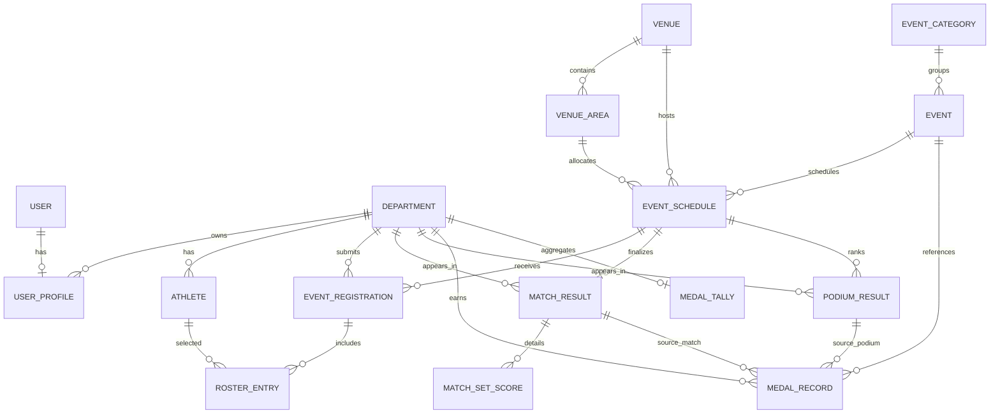

# 04 - Data Model

## Data Architecture Overview

The backend uses a relational schema organized around four domains:

- core references (departments, venues, user profiles)
- event catalog (categories and events)
- competition operations (schedules, rosters, results)
- AI audit logs (Rooney query history)

## Entity Relationship Diagram

## Core Entities

### Department

- unique `name`
- unique `acronym`
- optional `color_code`

Referenced by user profiles, athletes, registrations, results, medal records, and tally.

### UserProfile

- one-to-one with Django user
- `role` enum: `admin` or `department_rep`
- optional department association

## Venue and Space Model

### Venue

Logical facility location.

### VenueArea

Subdivision of venue (court, lane set, esports room, etc.).

Used in schedule conflict validation.

## Event Catalog Model

### EventCategory

- unique `name`
- `is_medal_bearing`

### Event

- foreign key to category
- `result_family`: `match_based` or `rank_based`
- `status`: scheduled/live/completed/postponed/cancelled
- `is_program_event` to represent non-medal program activities

## Tournament Operational Model

### EventSchedule

Binds event to venue/time.

### Athlete

Department-owned athlete record including eligibility-related flags:

- `is_enrolled`
- `medical_cleared`

### EventRegistration

Department submission for a schedule.

Constraint:

- unique pair (`schedule`, `department`)

### RosterEntry

Join row between registration and athlete.

Constraint:

- unique pair (`registration`, `athlete`)

## Result Models

### MatchResult

One-to-one with schedule for head-to-head events.

Fields include scores, winner, draw flag, finalization flag, and recorder.

### MatchSetScore

Optional per-set or per-period breakdown.

Constraint:

- unique pair (`match`, `set_number`)

### PodiumResult

Ranked placement row for rank-based events.

Constraints:

- unique pair (`schedule`, `rank`)
- medal enum: gold/silver/bronze/none

## Medal and Standing Models

### MedalRecord

Ledger record representing awarded medal for a department and event.

Constraint:

- unique pair (`department`, `event`)

Includes optional source links to match or podium rows.

### MedalTally

One-to-one aggregate per department.

Fields:

- `gold`
- `silver`
- `bronze`
- `total_points`

Sort order is medal-priority descending.

## Rooney Audit Model

### RooneyQueryLog

Captures each Rooney request and response metadata:

- question
- answer text
- grounded flag
- source labels
- refusal reason
- timestamp

## Derived Data and Consistency Rules

1. `MedalTally` is derived from `MedalRecord`, not source-of-truth data.
2. Signal handlers recompute tally on medal create/delete.
3. Result finalization services write or update medal records.
4. Registration validation enforces department roster ownership.
5. Schedule validation prevents overlapping active use of same venue area.

## Current Data Model Strengths

- clear separation between raw results and standings
- support for multiple result families
- role and department linkage in profile model
- explicit roster bridge supports variable team size

## Current Data Model Constraints and Future Opportunities

- no soft-delete or versioning strategy for operational entities
- no explicit historical stage model (quarterfinal/final/bronze match)
- no per-event medal rule strategy table
- no indexing strategy documented for expected scale-up
