# 06 - Runtime Flows

This document describes the critical runtime interactions across the React frontend, Django REST API, PostgreSQL database, and external AI/security/email services.

## Flow 1: Login and Session Initialization

Access tokens are held in frontend runtime memory only. Refresh tokens are issued by Django as HttpOnly cookies and are not readable by JavaScript.

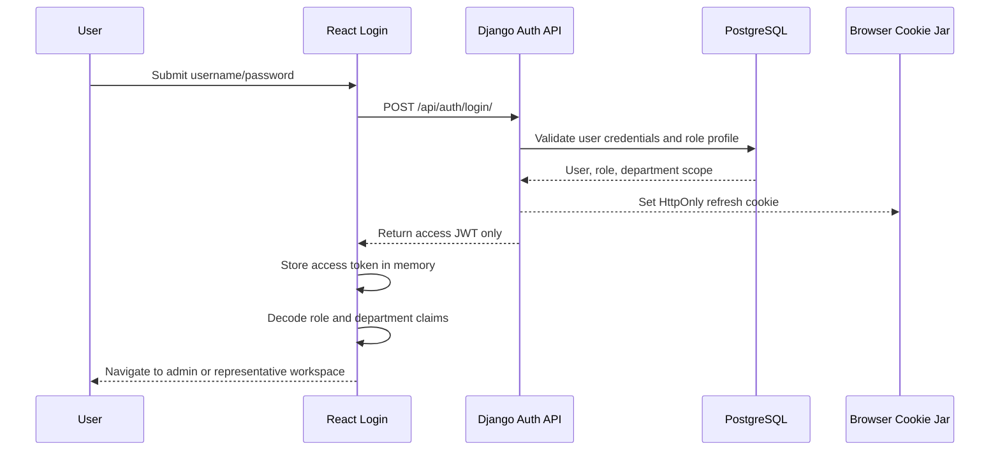

## Flow 2: Session Restore After Page Reload

Because access tokens live only in memory, a reload clears the access token. The app restores the session by asking the backend to refresh from the HttpOnly cookie.

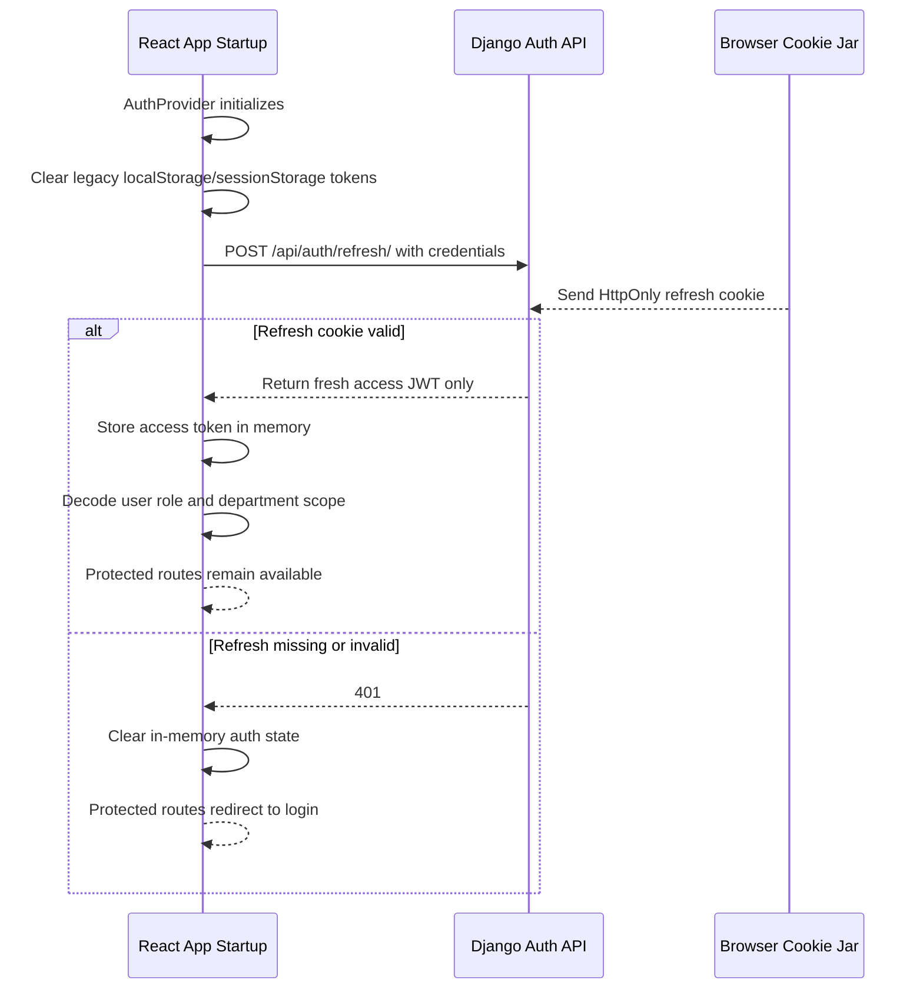

## Flow 3: Protected API Request with Cookie-Based Refresh

The Axios client attaches the in-memory access token to protected requests. On one 401 retry, it refreshes by relying on the browser cookie.

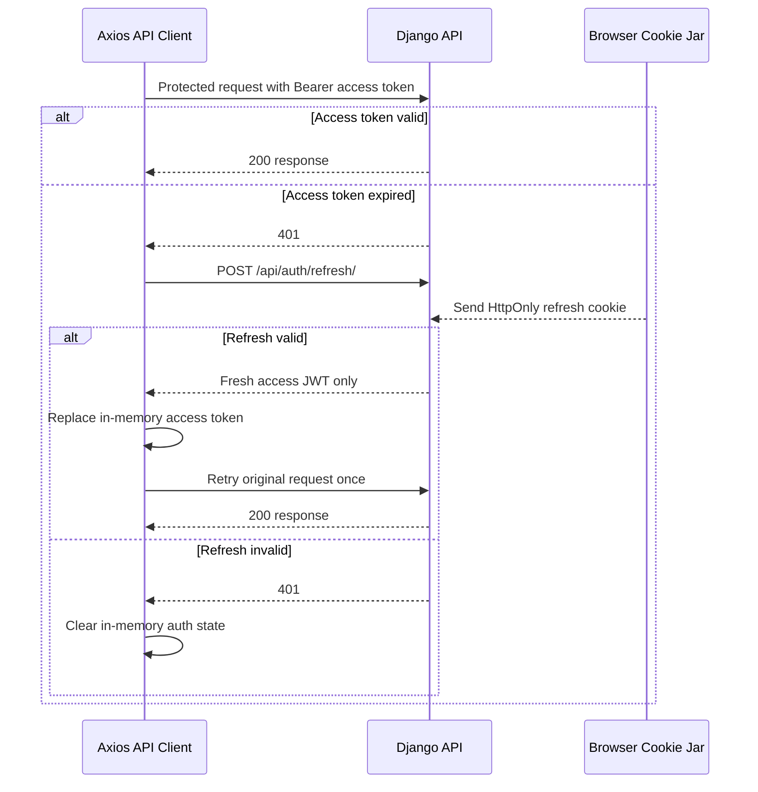

## Flow 4: Logout

Logout clears both the in-memory access token and the backend-issued refresh cookie.

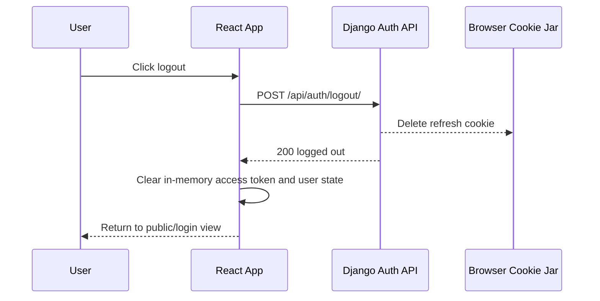

## Flow 5: Public Verified Tryout Application

Students do not have accounts in v1. They submit a public tryout application after Turnstile verification and school-email OTP verification.

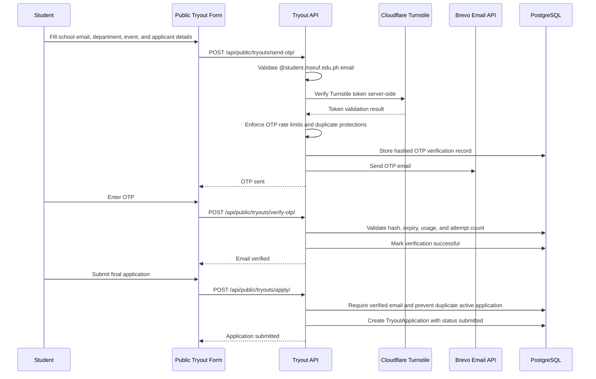

## Flow 6: Department Representative Tryout Review and Athlete Conversion

Representatives are scoped to exactly one department. Private application, participant, roster, and registration data must remain department-scoped.

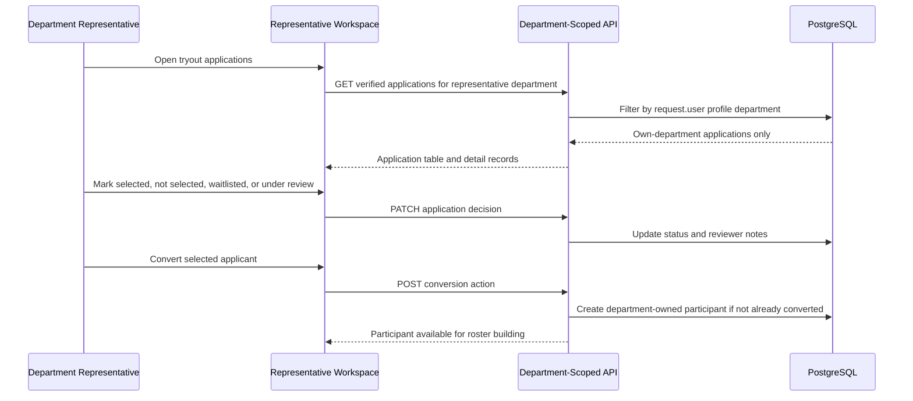

## Flow 7: Department Registration Submission

Official intramurals registration is separate from public tryout status. Representatives submit rosters to admin for review.

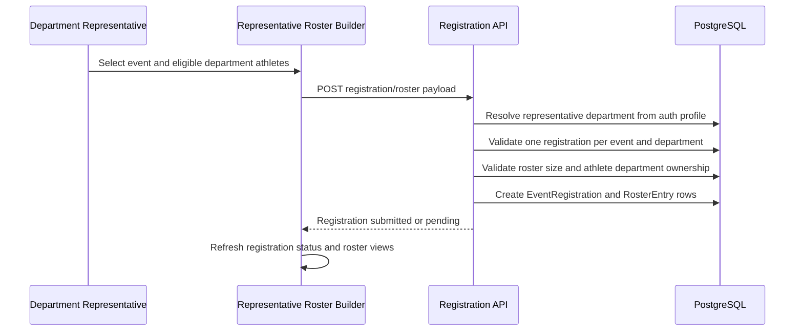

## Flow 8: Admin Registration Review

Admins approve, reject, or request revisions. Representatives can later resubmit only their own department registration when revision is needed.

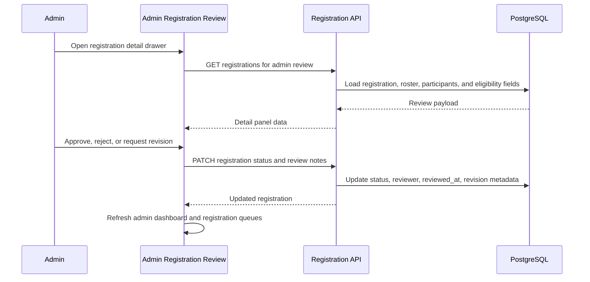

## Flow 9: Final Match Result to Medal Tally and AI Recap Draft

Finalized match-based results update medals and also generate a grounded AI recap draft. The draft is internal until an admin publishes it as news.

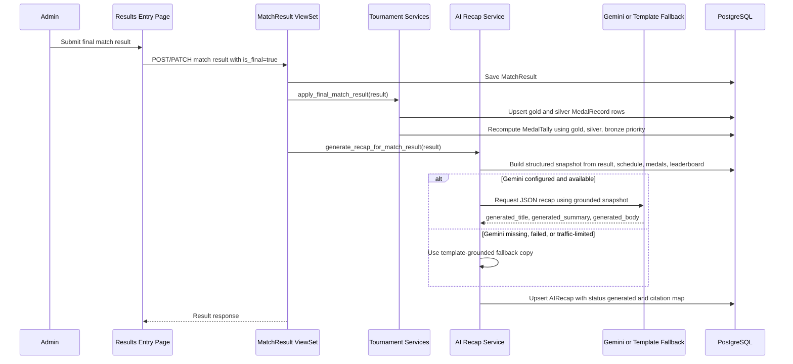

## Flow 10: Final Podium Result to Medal Tally and AI Recap Draft

Rank-based events such as swimming use podium rows. When final podium rows exist, the recap snapshot records placements and medal outcomes.

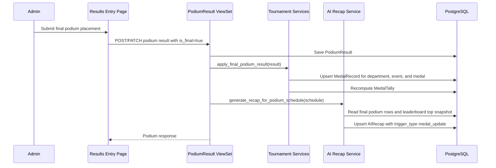

## Flow 11: Admin AI Recap Review to Published News

AI recaps are not public by default. Admins review, edit, approve, discard, or publish them into official news.

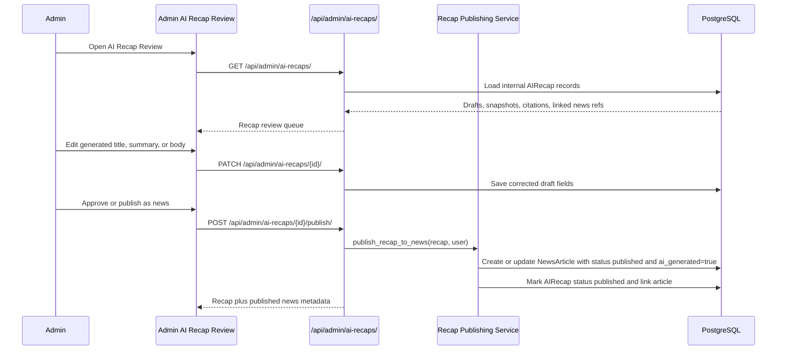

## Flow 12: Manual News Management

Manual news is official content. Admin drafts and published AI recaps share the NewsArticle model, but only published articles are visible to public users and representatives.

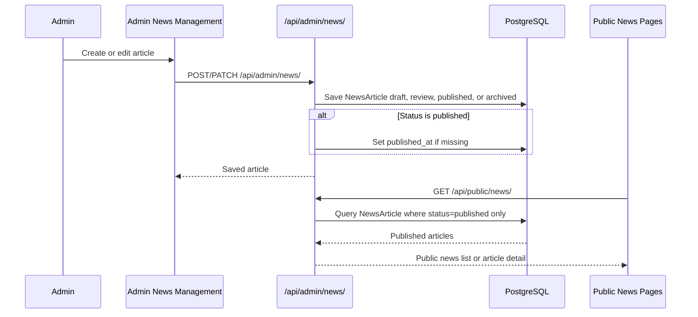

## Flow 13: Rooney Grounded Query

Rooney can use official public sources, including published news, schedules, results, medal tally, and leaderboard. It must not use internal AI recap drafts, discarded recaps, article drafts, admin notes, or private representative workflow data.

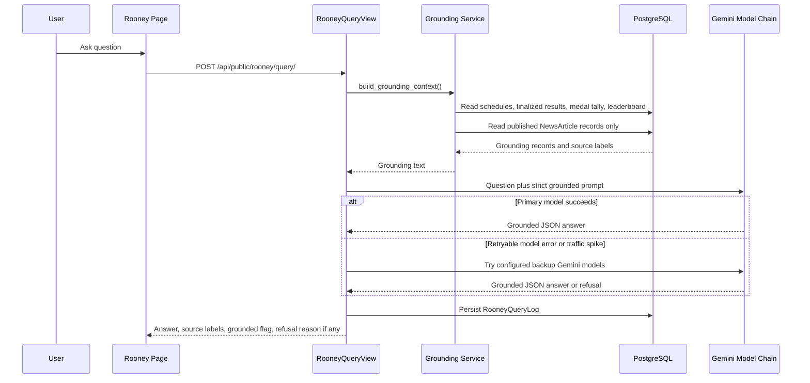

## Flow 14: Public Home, Results, Schedules, and News Browsing

Public pages only read public-safe endpoints. They never expose private admin data, representative review notes, or unpublished AI output.

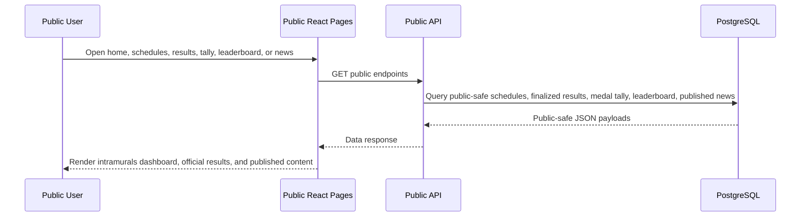

## Core Runtime Rules

### Authentication

- access JWTs are stored in frontend memory only through `frontend/src/services/auth.ts`
- refresh JWTs are set and cleared by Django through an HttpOnly cookie
- the frontend sends cookies with `withCredentials: true`
- app startup restores sessions with `POST /api/auth/refresh/`
- legacy localStorage/sessionStorage tokens are cleared during auth initialization
- JWT lifetimes, algorithm, secret, and refresh-cookie settings are environment-driven in Django settings

### Authorization

- admin endpoints use staff/superuser permissions for management workflows
- department representative workflows must resolve department scope from the authenticated user profile
- representatives can manage only their own tryouts, participants, rosters, and registrations
- public viewers can read schedules, results, medal tally, leaderboard, published news, and Rooney answers

### Medal Ranking

- standings use Olympic-style medal priority only
- sorting is gold descending, then silver descending, then bronze descending, then department name ascending
- there is no points system and no weighted medal score

### AI and News

- AIRecap records are internal draft records
- NewsArticle records are official content records
- AI recap generation is grounded in structured result, schedule, medal, and leaderboard snapshots
- AI recap drafts are not public until published into NewsArticle
- public news endpoints return only `status=published`
- Rooney may ground on published news but not raw recap drafts or article drafts
- Gemini model selection uses `GEMINI_PRIMARY_MODEL`, with backup models from `GEMINI_BACKUP_MODELS`
- if Gemini is unavailable for recap generation, the backend uses a structured template fallback instead of inventing unsupported details

## Runtime Guarantees and Caveats

### Guarantees

- protected frontend requests use the in-memory access token and refresh via HttpOnly cookie
- refresh tokens are not exposed to frontend JavaScript
- public tryout OTPs are hashed before storage
- Turnstile is verified server-side before OTP issuance
- public news pages show only published NewsArticle records
- AI recaps are reviewable through stored input snapshots and citation maps
- Rooney responses are schema-constrained, source-labeled, and logged
- medal tally ranking follows gold, silver, bronze priority with no points display

### Caveats

- no distributed queue; AI generation and recap publication currently happen synchronously in request flow
- no optimistic locking or version checks for concurrent admin updates
- email delivery, Turnstile, and Gemini depend on external service availability and correct environment variables
- AI recap generation falls back to grounded template copy when Gemini is unavailable
