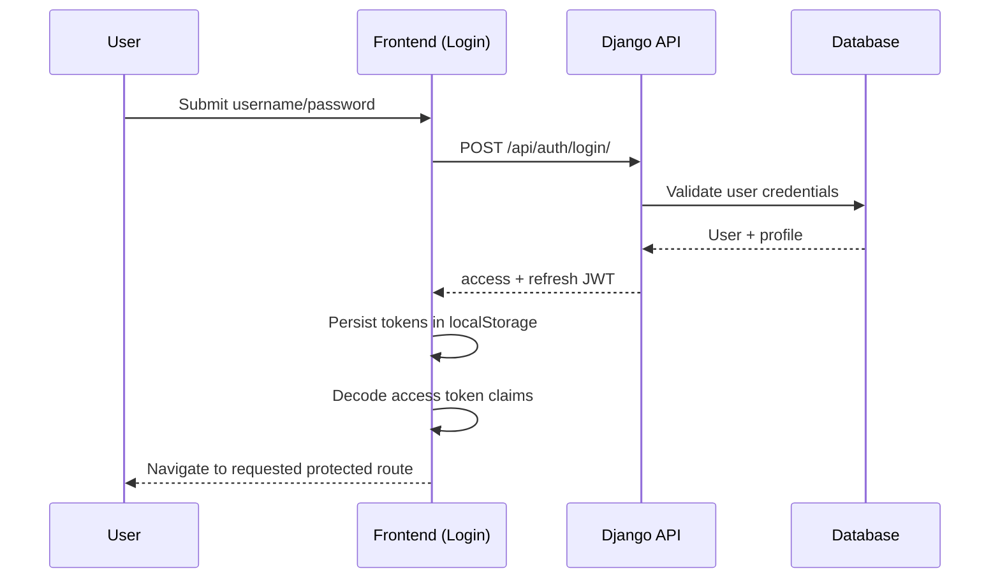
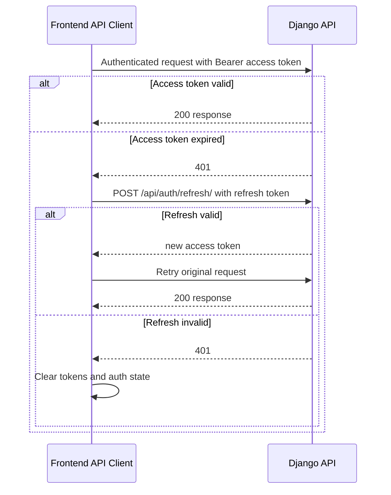
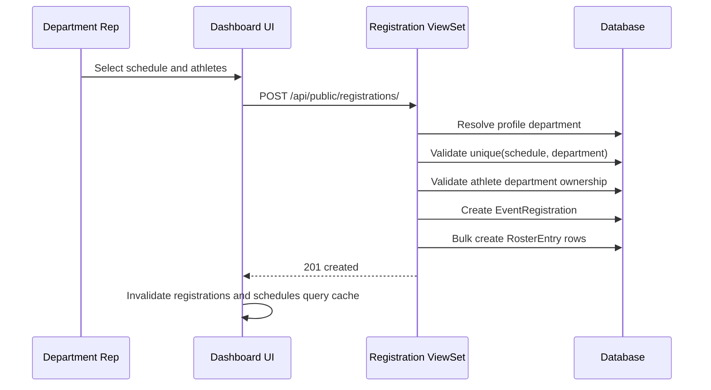
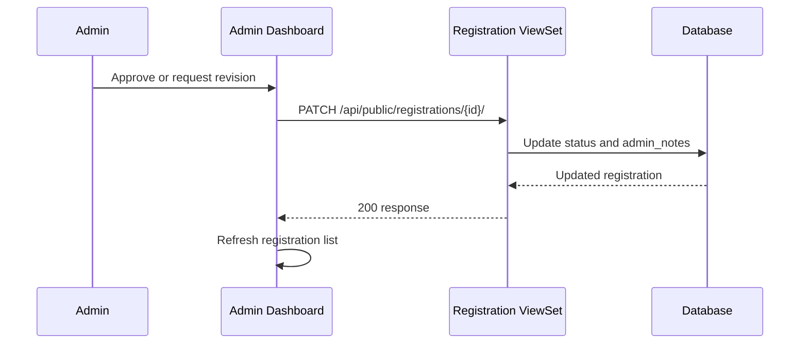
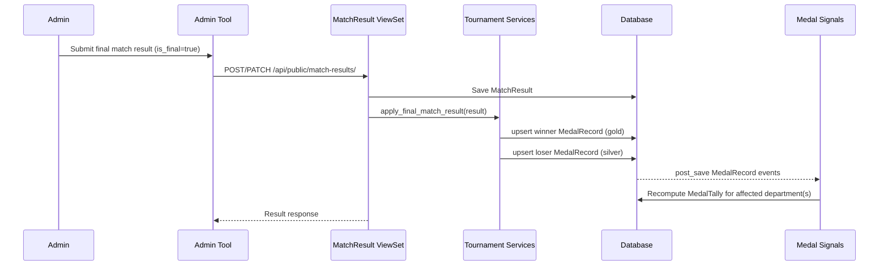
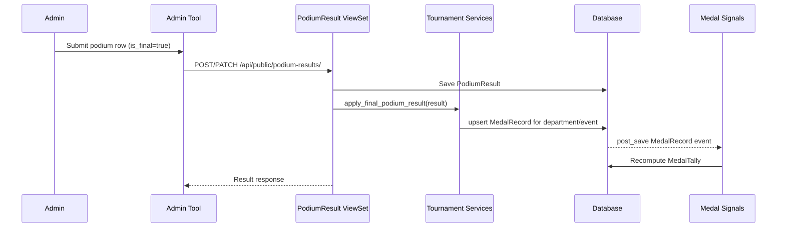
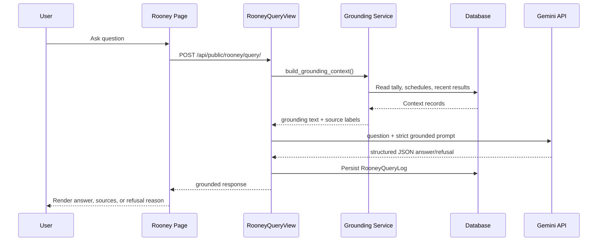
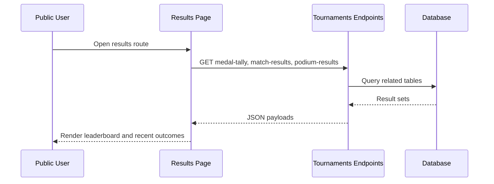

# 06 - Runtime Flows

This document describes critical runtime interactions across frontend, backend, database, and external LLM services.

## Flow 1: Login and Session Initialization

## Flow 2: Protected API Request with Token Refresh

## Flow 3: Department Registration Submission

## Flow 4: Admin Approval / Revision Feedback

## Flow 5: Final Match Result to Medal Tally

## Flow 6: Final Podium Result to Medal Tally

## Flow 7: Rooney Grounded Query

## Flow 8: Public Results Browsing

## Runtime Guarantees and Caveats

### Guarantees

- medal tally reflects medal ledger mutations via signal recomputation
- Rooney responses are schema-constrained and logged
- department reps cannot list other departments' athletes/registrations through current queryset logic

### Caveats

- no distributed queue; all workflows are synchronous in-request
- no optimistic locking or version checks for concurrent admin updates
- medal finalization policy does not yet encode bracket stage semantics explicitly
