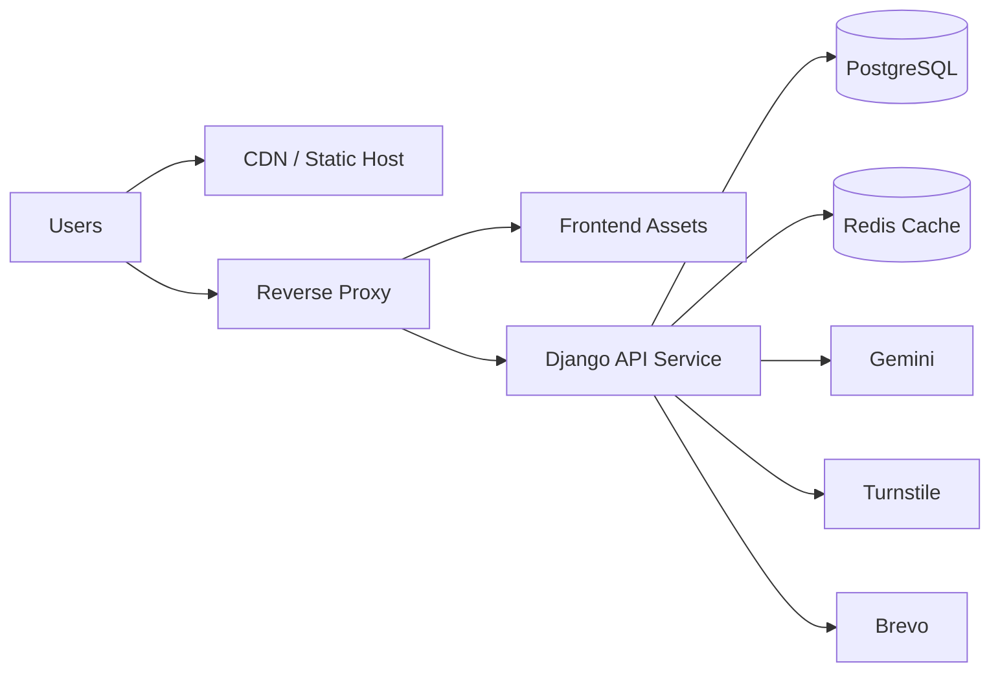

# 07 - Deployment and Operations

## Environments

## Development

- Backend runs with Django dev server.
- Frontend runs with Vite dev server.
- Database is SQLite at `backend/db.sqlite3`.
- CORS origins are controlled through `CORS_ALLOWED_ORIGINS`; if empty in debug mode, all origins are allowed for local development.
- Refresh-token cookies are HttpOnly; `JWT_REFRESH_COOKIE_SECURE=False` is expected for plain localhost.

## Intended Production Direction

The repository does not yet include a dedicated production settings module. A hardened profile should add:

- WSGI/ASGI app server
- reverse proxy or platform routing
- PostgreSQL database
- static asset hosting with cache policy
- TLS termination and secure headers
- restricted CORS and CSRF trusted origins
- secure refresh cookie settings
- structured logging and health checks

## Local Operations Runbook

### Backend

```bash
cd backend
pip install -r requirements.txt
python manage.py migrate
python manage.py seed_data
python manage.py runserver
```

### Frontend

```bash
cd frontend
npm install
npm run dev
```

## Environment Variables

Templates exist at:

- `backend/.env.example`
- `frontend/.env.example`

### Backend Variables

- `SECRET_KEY`
- `DEBUG`
- `ALLOWED_HOSTS`
- `CORS_ALLOWED_ORIGINS`
- `CORS_ALLOW_CREDENTIALS`
- `CSRF_TRUSTED_ORIGINS`
- `DATABASE_URL` (documented for future PostgreSQL use; current settings still use SQLite)
- `JWT_SECRET_KEY`
- `JWT_ALGORITHM`
- `JWT_ACCESS_TOKEN_LIFETIME_MINUTES`
- `JWT_REFRESH_TOKEN_LIFETIME_DAYS`
- `JWT_ROTATE_REFRESH_TOKENS`
- `JWT_BLACKLIST_AFTER_ROTATION`
- `JWT_UPDATE_LAST_LOGIN`
- `JWT_REFRESH_COOKIE_NAME`
- `JWT_REFRESH_COOKIE_SECURE`
- `JWT_REFRESH_COOKIE_HTTPONLY`
- `JWT_REFRESH_COOKIE_SAMESITE`
- `JWT_REFRESH_COOKIE_DOMAIN`
- `JWT_REFRESH_COOKIE_PATH`
- `GEMINI_API_KEY`
- `GEMINI_PRIMARY_MODEL`
- `GEMINI_BACKUP_MODELS`
- `TURNSTILE_SECRET_KEY`
- `BREVO_API_KEY`
- `BREVO_SENDER_EMAIL`
- `BREVO_SENDER_NAME`
- `TRYOUT_ALLOWED_EMAIL_DOMAIN`
- `TRYOUT_OTP_EXPIRY_MINUTES`
- `TRYOUT_VERIFIED_APPLICATION_WINDOW_MINUTES`
- `TRYOUT_MAX_VERIFY_ATTEMPTS`
- `TRYOUT_MAX_OTP_REQUESTS_PER_HOUR`
- `TRYOUT_MAX_APPLICATIONS_PER_HOUR`

### Frontend Variables

- `VITE_API_URL`
- `VITE_TURNSTILE_SITE_KEY`

No frontend variable should contain secrets.

## Data Lifecycle and Seeding

`seed_data` recreates:

- departments and representative accounts
- admin account
- venues and venue areas
- event categories and events
- schedules
- athletes
- tryout applications
- registrations and rosters
- match/podium results
- medal records and tallies
- official news articles
- AI recap drafts

This command is for repeatable demo environments, not production data migration.

## Backup and Recovery Guidance

## Development

- back up `backend/db.sqlite3` before destructive seeds
- store snapshots before major schema migration work

## Production Recommendation

- use PostgreSQL point-in-time recovery
- schedule logical dumps with retention
- validate migrations on staging snapshots
- keep rollback plans for schema changes affecting events, schedules, and results

## Build and Release Pipeline Recommendation

A practical CI/CD baseline:

1. install backend dependencies
2. run `python manage.py check`
3. run `python manage.py test`
4. run migration check
5. install frontend dependencies
6. run `npm run lint`
7. run `npm run build`
8. deploy to staging
9. smoke test auth, public pages, tryouts, admin workflows, AI recap/news, Rooney
10. promote to production with rollback hooks

## Observability Status

Current state:

- Rooney and recap fallbacks return structured refusal/fallback responses
- Rooney queries are persisted as audit logs
- AI recaps store input snapshots and citation maps
- no structured application logging format committed
- no metrics, tracing, or health endpoint strategy committed

Recommended additions:

- JSON structured logs with correlation IDs
- request timing middleware
- `/health` and `/ready` endpoints
- alerting on API error rate, auth refresh failures, Rooney refusal/error ratio, and email/Turnstile failures

## Scalability Considerations

Current bottlenecks:

- SQLite write contention under concurrent traffic
- synchronous Gemini, Turnstile, and Brevo calls increase request latency
- no cache layer for public standings/news/schedule reads
- public tryout endpoints use Django cache-backed rate limiting but no external distributed cache is configured

Scale-up recommendations:

1. wire `DATABASE_URL` to PostgreSQL settings
2. introduce Redis for cache/rate-limit storage
3. move Rooney and AI recap generation to an async task queue
4. add pagination and filtering defaults where result sets may grow
5. add CDN/static hosting for frontend assets

## Deployment Topology (Recommended)



## Release Safety Checklist

- verify migrations on staging snapshot
- verify admin and department-rep permissions
- verify access token memory storage and refresh-cookie restore
- verify logout clears refresh cookie
- verify public tryout Turnstile and OTP behavior
- verify schedule conflict validation
- verify event edit safeguards with linked schedules/results
- verify medal tally consistency after final result writes
- verify AI recap generation fallback with and without `GEMINI_API_KEY`
- verify public news only returns published articles
- verify Rooney grounding and refusal behavior
