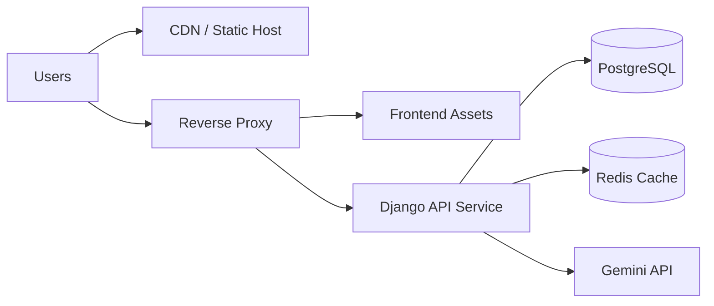

# 07 - Deployment and Operations

## Environments

## Development (Current)

- Backend runs with Django dev server.
- Frontend runs with Vite dev server.
- Database is SQLite file at `backend/db.sqlite3`.
- CORS is fully open for local cross-origin testing.

## Intended Production Direction

Current repository does not include a dedicated production settings module. A hardened target profile is recommended:

- WSGI/ASGI app server (gunicorn or uvicorn workers)
- reverse proxy (Nginx)
- PostgreSQL managed database
- static asset hosting with cache policy
- TLS termination and secure headers

## Local Operations Runbook

### Backend

```bash
cd backend
pip install -r requirements.txt
python manage.py migrate
python manage.py seed_data
python manage.py runserver
```

### Frontend

```bash
cd frontend
npm install
npm run dev
```

## Environment Variables

Observed and expected variables from code and setup docs:

- `SECRET_KEY`
- `DEBUG`
- `GEMINI_API_KEY`

Note: the repository currently lacks a committed `backend/.env.example` template.

## Data Lifecycle and Seeding

`seed_data` command behavior:

- clears prior demo and domain records
- recreates departments, demo users, venues, categories, events, schedules
- seeds athletes, registrations, match/podium results
- populates medal ledger and tally entries

This command is optimized for repeatable demo environments, not production migration scenarios.

## Backup and Recovery Guidance

## Development

- back up `backend/db.sqlite3` before destructive seeds
- store snapshots before major schema migration work

## Production Recommendation

- use PostgreSQL point-in-time recovery
- daily logical dumps plus retention policy
- migration rollback procedures and canary releases

## Build and Release Pipeline Recommendation

A practical CI/CD baseline:

1. lint and type-check frontend
2. run backend tests
3. run frontend tests
4. run Django migration check
5. build frontend static bundle
6. build backend artifact/container
7. deploy to staging with smoke tests
8. promote to production with rollback hooks

## Observability Status

Current state:

- Rooney errors print traceback server-side and return refusal payload
- no structured application logging format committed
- no metrics, tracing, or health endpoint strategy documented

Recommended minimum observability additions:

- JSON structured logs with correlation IDs
- request/response timing middleware
- `/health` and `/ready` endpoints
- alerting on error rate spikes and Rooney failure ratio

## Scalability Considerations

Current bottlenecks in growth scenarios:

- SQLite write contention under concurrent traffic
- in-process synchronous Rooney calls increase request latency
- no caching layer for frequently read public leaderboard/schedule endpoints

Scale-up recommendations:

1. migrate to PostgreSQL
2. introduce Redis cache for read-heavy public endpoints
3. move Rooney request handling to async task queue for long-running calls
4. add pagination and filtering defaults where result sets may grow

## Deployment Topology (Recommended)



## Release Safety Checklist

- verify migrations on staging snapshot
- verify role-based endpoint access controls
- verify medal tally consistency after sample final result writes
- verify Rooney fallback behavior with and without `GEMINI_API_KEY`
- verify frontend token refresh workflow and forced logout path
