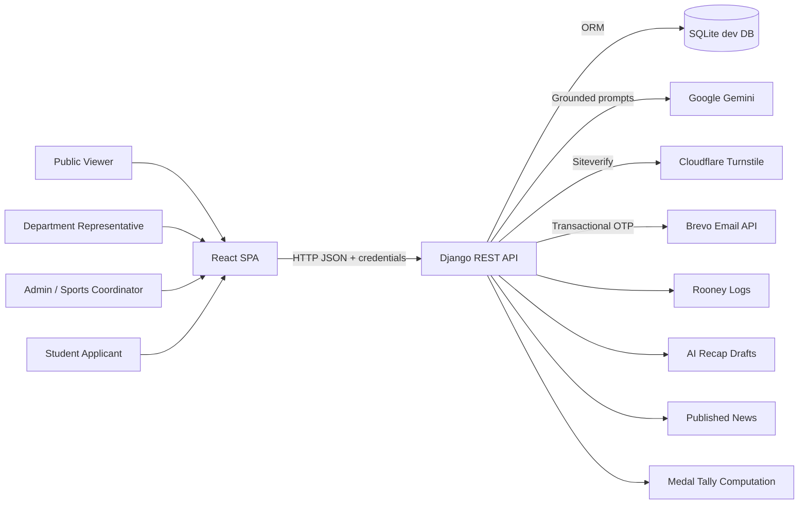

# Enverga Arena Architecture Documentation

Last updated: 2026-04-28

This directory documents the current implementation of Enverga Arena, the MSEUF intramurals registration, results, medal tally, public tryout, official news, Rooney AI, and AI recap review platform.

## Documentation Map

1. [01-system-overview.md](./01-system-overview.md)
2. [02-backend-architecture.md](./02-backend-architecture.md)
3. [03-frontend-architecture.md](./03-frontend-architecture.md)
4. [04-data-model.md](./04-data-model.md)
5. [05-api-contracts.md](./05-api-contracts.md)
6. [06-runtime-flows.md](./06-runtime-flows.md)
7. [07-deployment-and-operations.md](./07-deployment-and-operations.md)
8. [08-security-testing-and-risks.md](./08-security-testing-and-risks.md)
9. [09-architecture-decisions-and-roadmap.md](./09-architecture-decisions-and-roadmap.md)

## Architecture at a Glance

- Backend: Django 6 + Django REST Framework + SimpleJWT.
- Frontend: React 19 + TypeScript + Vite 8 + Tailwind CSS v4 + DaisyUI.
- Data store: SQLite in the committed local/dev configuration; PostgreSQL driver is installed for the intended production direction.
- Auth model: access JWT in frontend memory only; refresh JWT in backend-issued HttpOnly cookie.
- AI integration: Google Gemini through `google-genai`, with `gemini-2.5-flash-lite` as the default primary model and configurable backup models.
- Public verification: Cloudflare Turnstile server verification plus Brevo transactional email OTP for public student tryout applications.
- Content model: internal `AIRecap` drafts are reviewed by admins before publication as public `NewsArticle` records.
- Domain model: departments, venues/areas, event catalog, schedules, tryout applications, participants, registrations, rosters, match/podium results, medal ledger, computed medal tally.

## System Context

## Source of Truth

The docs were synced against these implementation areas:

- `backend/backend/settings.py`
- `backend/backend/urls.py`
- `backend/core/*`
- `backend/events/*`
- `backend/tournaments/*`
- `backend/rooney/*`
- `frontend/src/*`
- `frontend/package.json`
- `backend/requirements.txt`

## Current State Summary

- The system is a modular monolith with a React SPA and Django API.
- API endpoints are organized under `/api/public/`, `/api/admin/`, and `/api/auth/`.
- Protected requests use bearer access tokens from memory; session persistence uses an HttpOnly refresh cookie.
- Public tryout applications use Turnstile + student email OTP and do not create student accounts.
- Admin pages now include management flows for venues, events, schedules, registrations, participants, news, AI recaps, Rooney logs, medal tally, and leaderboard.
- Department representatives are scoped to one department and manage tryout review, participant conversion, rosters, and registrations.
- Medal standings are medal-priority only: gold, then silver, then bronze. There is no points ranking.
- Rooney is grounding-first and may use published news, schedules, results, medal tally, and leaderboard as sources.

## Known Gaps Highlighted by This Documentation

- The dev settings still use SQLite directly even though `psycopg2-binary` is installed for PostgreSQL readiness.
- DRF default permission is still `AllowAny`; current safety depends on per-view permissions and queryset scoping.
- AI calls are synchronous in-request; no task queue is in place.
- Frontend test tooling is not configured yet.
- The production settings split, health endpoints, and observability stack remain roadmap work.
