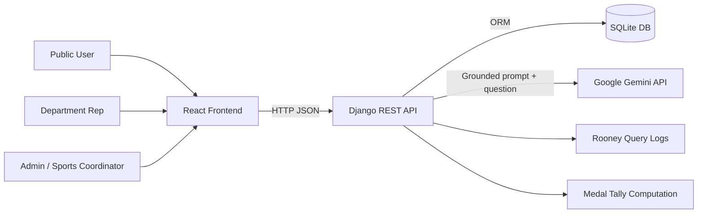

# Enverga Arena Architecture Documentation

Last updated: 2026-04-27

This directory contains the full architecture documentation for Enverga Arena, the MSEUF intramurals registration, results, and medal tally platform with Rooney AI support.

## Documentation Map

1. [01-system-overview.md](./01-system-overview.md)
2. [02-backend-architecture.md](./02-backend-architecture.md)
3. [03-frontend-architecture.md](./03-frontend-architecture.md)
4. [04-data-model.md](./04-data-model.md)
5. [05-api-contracts.md](./05-api-contracts.md)
6. [06-runtime-flows.md](./06-runtime-flows.md)
7. [07-deployment-and-operations.md](./07-deployment-and-operations.md)
8. [08-security-testing-and-risks.md](./08-security-testing-and-risks.md)
9. [09-architecture-decisions-and-roadmap.md](./09-architecture-decisions-and-roadmap.md)

## Architecture at a Glance

- Backend: Django + Django REST Framework + SimpleJWT.
- Frontend: React 19 + TypeScript + Vite + Tailwind v4 + DaisyUI.
- Data store: SQLite in current repository setup.
- AI integration: Google Gemini (gemini-2.5-flash-lite) via Rooney service.
- Domain model: events, schedules, registrations, match/podium results, medal ledger, computed medal tally.
- Access model: public read endpoints plus JWT-protected admin/department-rep workflows.

## System Context

## Source of Truth

The architecture docs were derived from implementation in:

- `backend/backend/settings.py`
- `backend/backend/urls.py`
- `backend/core/*`
- `backend/events/*`
- `backend/tournaments/*`
- `backend/rooney/*`
- `frontend/src/*`

## Current State Summary

- The system is implemented as a modular monolith.
- API endpoints are organized under `/api/public/` and `/api/auth/`.
- Authorization is enforced in viewsets and role-based frontend route guards.
- Medal standings are derived data, recomputed from an immutable medal ledger.
- Rooney is grounding-first: answers are generated from live DB context and logged.

## Known Gaps Highlighted by This Documentation

- Production database switching is not yet implemented in settings.
- There is no committed `.env.example` file in `backend/`.
- Automated tests are currently placeholders in all backend apps.
- CORS and default DRF permissions are permissive and should be hardened for production.
