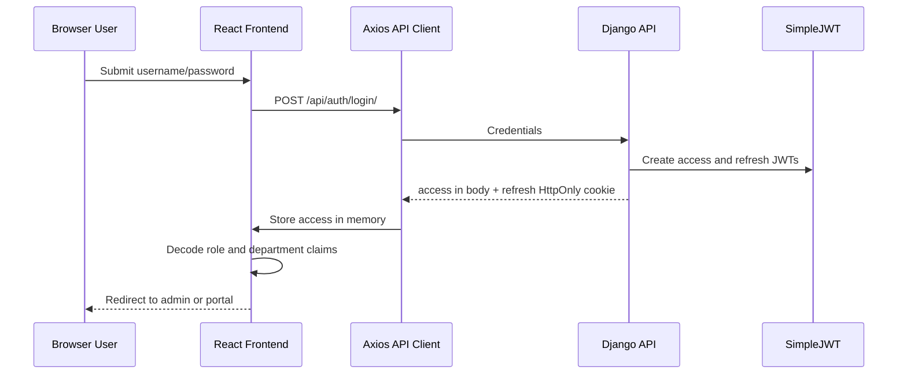

# docs/auth/README.md

# Authentication Documentation

## Quick Inventory

### Auth-Related Files Found

Backend:

- `backend/backend/settings.py`
- `backend/backend/urls.py`
- `backend/core/views.py`
- `backend/core/serializers.py`
- `backend/core/models.py`
- `backend/core/tests.py`
- `backend/events/views.py`
- `backend/tournaments/views.py`
- `backend/tournaments/serializers.py`
- `backend/rooney/views.py`
- `backend/.env.example`
- `backend/requirements.txt`

Frontend:

- `frontend/src/App.tsx`
- `frontend/src/context/AuthContext.tsx`
- `frontend/src/services/auth.ts`
- `frontend/src/services/api.ts`
- `frontend/src/components/ProtectedRoute.tsx`
- `frontend/src/pages/Auth/Login.tsx`
- `frontend/src/components/layout/Navbar.tsx`
- `frontend/src/components/layout/OperationsLayout.tsx`
- `frontend/src/hooks/useAdminData.ts`
- `frontend/src/hooks/usePublicData.ts`
- `frontend/src/services/tryouts.ts`
- `frontend/.env.example`
- `frontend/package.json`

### Auth-Related Packages Found

Backend:

- `Django==6.0.4`
- `djangorestframework==3.17.1`
- `djangorestframework_simplejwt==5.5.1`
- `PyJWT==2.12.1`
- `django-cors-headers==4.9.0`
- `python-dotenv==1.2.2`

Frontend:

- `axios@^1.15.2`
- `jwt-decode@^4.0.0`
- `react@^19.2.5`
- `react-dom@^19.2.5`
- `react-router-dom@^7.14.2`
- `@tanstack/react-query@^5.100.1`

### Auth-Related Endpoints Found

- `POST /api/auth/login/`
- `POST /api/auth/refresh/`
- `POST /api/auth/logout/`
- `GET /api/auth/me/`

Other protected endpoints are guarded by DRF permissions and include examples such as:

- `/api/admin/news/`
- `/api/admin/ai-recaps/`
- `/api/public/athletes/`
- `/api/public/registrations/`
- `/api/public/tryout-applications/`
- write methods on `/api/public/events/`, `/api/public/schedules/`, `/api/public/match-results/`, `/api/public/podium-results/`, and related operational resources

## Overview

Enverga Arena uses JWT authentication implemented with Django REST Framework and SimpleJWT on the backend, coordinated with an in-memory frontend access token store.

The current implementation follows this model:

- The backend authenticates username/password credentials.
- The backend returns the access token in the login response body.
- The backend removes the refresh token from the JSON response and sets it as an HttpOnly cookie.
- The frontend stores the access token only in runtime memory.
- The frontend never stores the active access token or refresh token in `localStorage` or `sessionStorage`.
- On full page reload, the frontend calls `/api/auth/refresh/`.
- The browser sends the HttpOnly refresh cookie automatically because Axios is configured with `withCredentials: true`.
- If refresh succeeds, the frontend receives a new access token, stores it in memory, decodes user claims, and keeps the user logged in.
- Protected routes wait for this restore attempt before redirecting to login.

## Auth Goals

The auth system is designed to support:

- admin-only sports operations pages
- one-department-scoped representative portal pages
- anonymous public pages
- persistent login across page reloads
- reduced token exposure in browser storage
- API-first protected requests
- role-based frontend routing
- backend-enforced permissions for sensitive data and admin workflows

## High-Level Architecture

## Token Strategy Summary

| Token | Storage | Who Can Read It | Purpose |
| --- | --- | --- | --- |
| Access JWT | Frontend runtime memory only | React/JavaScript while app is loaded | Sent in `Authorization: Bearer <token>` for protected API calls |
| Refresh JWT | Backend-set HttpOnly cookie | Browser sends it; JavaScript cannot read it | Used by `/api/auth/refresh/` to obtain a new access token |

The frontend file `frontend/src/services/auth.ts` owns the in-memory access token variable. It also clears legacy `localStorage` and `sessionStorage` token keys from older implementations.

## Backend/Frontend Interaction Summary

1. `frontend/src/pages/Auth/Login.tsx` submits credentials through `loginRequest()`.
2. `frontend/src/services/api.ts` posts credentials to `/auth/login/`.
3. `backend/core/views.py` uses `CookieTokenObtainPairView`.
4. `backend/core/serializers.py` adds role and department claims to the JWT.
5. `CookieTokenObtainPairView` stores the refresh token in an HttpOnly cookie and leaves only `access` in the response body.
6. The frontend decodes the access token with `jwt-decode`.
7. `frontend/src/components/ProtectedRoute.tsx` gates admin and representative route groups.
8. If a request returns `401`, the Axios response interceptor attempts `/auth/refresh/` once and retries the original request.

## Security Model Summary

The main security improvement is that active tokens are not persisted in frontend-readable browser storage.

Implemented protections:

- access token is memory-only
- refresh token is HttpOnly
- refresh cookie settings are environment-driven
- protected backend views use DRF permissions
- role and department scope are included in token claims
- frontend route guards wait for reload rehydration
- legacy browser storage token keys are cleared
- CORS credentials are enabled through backend settings

Remaining operational risks:

- the refresh cookie is not CSRF-token protected by a separate custom CSRF mechanism; current risk is reduced because refresh only returns an access token to the calling origin, and CORS should be locked down outside local development
- if `JWT_REFRESH_COOKIE_SAMESITE=None` is used in production, TLS and strict CORS/CSRF decisions become more important
- `/api/auth/me/` exists, but the frontend currently restores user state by decoding JWT claims instead of fetching the endpoint
- token blacklisting is configured through env values but the blacklist app is not in `INSTALLED_APPS`, so enabling blacklist settings alone would not provide blacklist persistence

## Documents In This Package

- [Backend Auth](./backend-auth.md)
- [Frontend Auth](./frontend-auth.md)
- [Auth Flow](./auth-flow.md)
- [Auth Files Reference](./auth-files-reference.md)
- [Auth Environment Reference](./auth-env-reference.md)
- [Auth Packages](./auth-packages.md)

